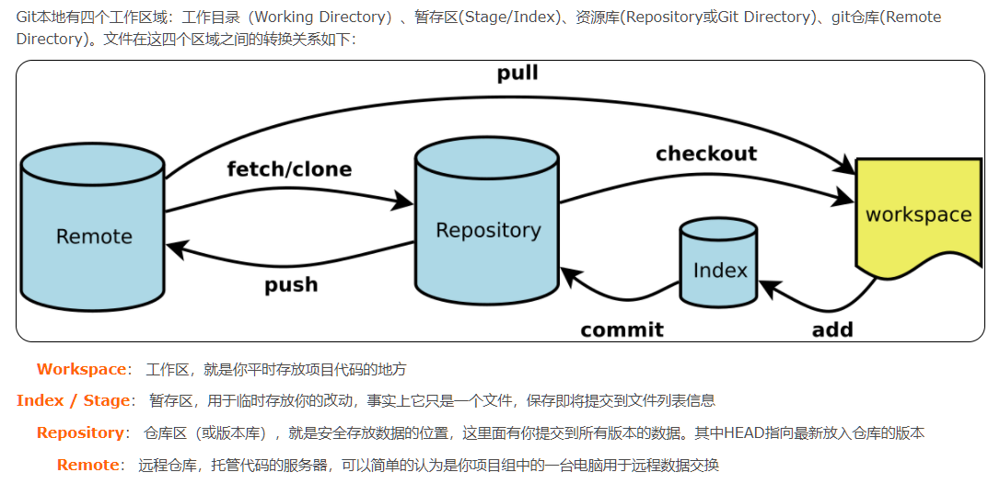

## 概述

## 基本流程
1. git status 查看工作区代码相对于暂存区的差别
2. git add . 将当前目录下修改的所有代码从工作区添加到暂存区 . 代表当前目录
3. git commit -m ‘注释’ 将缓存区内容添加到本地仓库
4. git pull origin master先将远程仓库master中的信息同步到本地仓库master中
5. git push origin master 将本地版本库推送到远程服务器，origin是远程主机，master表示是远程服务器上的master分支和本地分支重名的简写，分支名是可以修改的

## 分支


## 冲突
1. git stash 将修改放入暂存区
2. git pull，拉取远程
3. git stash pop，取出修改内容
4. git add、git commit、git push

## 放弃本地修改
1. 未使用git add 缓存代码

放弃某个文件的修改
```
git checkout -- filename
```
放弃所有文件修改 
```
git checkout .
```
2. 已使用git add 缓存代码，未使用git commit
   
放弃某个文件修改 
```
git reset HEAD filename
```
放弃所有文件修改 
```
git reset HEAD
```
3. 已经用 git commit 提交了代码
```
//来回退到上一次commit的状态
git reset --hard HEAD^
或者回退到任意版本
git reset --hard commit id

```
使用git log命令查看git提交历史和commit id


