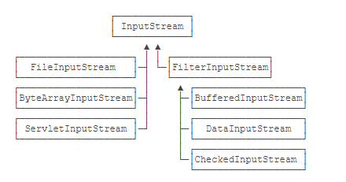

## Java中的设计模式
[链接](https://zhuanlan.zhihu.com/p/114244039 "leetcode知乎主页")  

### 简单工厂
1. 实现方式：
BeanFactory。Spring中的BeanFactory就是简单工厂模式的体现，根据传入一个唯一的标识来获得Bean对象，
2. 实质：
由一个工厂类根据传入的参数，动态决定应该创建哪一个产品类。
3. 实现原理：
bean容器的启动阶段：
读取bean的xml配置文件,将bean元素分别转换成一个BeanDefinition对象。然后通过BeanDefinitionRegistry将这些bean注册到beanFactory中，保存在它的一个ConcurrentHashMap中。将BeanDefinition注册到了beanFactory之后，在这里Spring为我们提供了一个扩展的切口，允许我们通过实现接口BeanFactoryPostProcessor 在此处来插入我们定义的代码。典型的例子就是：PropertyPlaceholderConfigurer，我们一般在配置数据库的dataSource时使用到的占位符的值，就是它注入进去的。
容器中bean的实例化阶段：
实例化阶段主要是通过反射或者CGLIB对bean进行实例化，在这个阶段Spring又给我们暴露了很多的扩展点：
- 各种的Aware接口 ，比如 BeanFactoryAware，对于实现了这些Aware接口的bean，在实例化bean时Spring会帮我们注入对应的BeanFactory的实例。
- BeanPostProcessor接口 ，实现了BeanPostProcessor接口的bean，在实例化bean时Spring会帮我们调用接口中的方法。
- InitializingBean接口 ，实现了InitializingBean接口的bean，在实例化bean时Spring会帮我们调用接口中的方法。
- DisposableBean接口 ，实现了BeanPostProcessor接口的bean，在该bean死亡时Spring会帮我们调用接口中的方法。

### 工厂方法
1. 实现方式：  FactoryBean接口。
2. 实现原理：
实现了FactoryBean接口的bean是一类叫做factory的bean。其特点是，spring会在使用getBean()调用获得该bean时，会自动调用该bean的getObject()方法，所以返回的不是factory这个bean，而是这个bean.getOjbect()方法的返回值。
3. 例子：
典型的例子有spring与mybatis的结合。

### 单例模式
1. spring bean的实例默认单例

### 适配器模式
1. spring的AOP增强或通知（advice）
- 相关的接口是AdvisorAdapter。Advice常用的类型有：BeforeAdvice（目标方法调用前,前置通知）、AfterAdvice（目标方法调用后,后置通知）、AfterReturningAdvice(目标方法执行结束后，return之前)等等。每个类型Advice都有对应的拦截器:MethodBeforeAdviceInterceptor、AfterReturningAdviceAdapter、AfterReturningAdviceInterceptor。Spring预定义的通知要通过对应的适配器，适配成 MethodInterceptor接口(方法拦截器)类型的对象（如：MethodBeforeAdviceInterceptor 负责适配 MethodBeforeAdvice）。
2. SpringMVC中的适配器HandlerAdatper
- 实现原理：HandlerAdatper根据Handler规则执行不同的Handler。
- 实现过程：DispatcherServlet根据HandlerMapping返回的handler，向HandlerAdatper发起请求，处理Handler。HandlerAdapter根据规则找到对应的Handler并让其执行，执行完毕后Handler会向HandlerAdapter返回一个ModelAndView，最后由HandlerAdapter向DispatchServelet返回一个ModelAndView。

### 装饰者模式
1. I/O
2. wrapper类、decorator类

- InputStream是抽象类，主要是read方法，读取下一个字节（0-255），-1表示已读到末尾  
- FileInputStream、ByteArrayInputStream、ServletInputStream 是 InputStream 的三个子类  
- BufferedInputStream（增强功能）、DataInputStream（增加方法readInt()、readLong()）、CheckedInputStream 是三个具体的装饰者类，他们都为 InputStream 增强了原有功能或添加了新功能  
- FilterInputStream 是所有装饰类的父类，它没有实现具体的功能，仅用来包装了一下 InputStream  
```
//缓冲池读取文件，类似于多次装饰
InputStream in = new BufferedInputStream(new FileInputStream("src/readme.txt"))

public class FilterInputStream extends InputStream { 

    protected volatile InputStream in;

    protected FilterInputStream(InputStream in) { 
        this.in = in; 
    } ​ 

    public int read() throws IOException { 
        return in.read(); 
    } 
    //... 
}
```  

### 观察者模式
1. kafka消息队列，订阅发布
2. 事件驱动，Listener
观察者：java.util.Observer
```
public interface Observer { 
    void update(Observable o, Object arg); 
}
```
被观察者：java.util.Obserable
```
public class Observable { 

    private boolean changed = false; 

    private Vector<Observer> obs; 

    public void notifyObservers(Object arg) { 

        Object[] arrLocal; 

        synchronized (this) { 
            if (!hasChanged()) return; 
            arrLocal = obs.toArray(); 
            clearChanged(); 
        } 
        
        for (int i = arrLocal.length - 1; i >= 0; i--) 
            ((Observer) arrLocal[i]).update(this, arg); 
    }
    ···
```
### 代理模式
1. AOP动态代理

### 模板方法
1. jdbcTemplate
2. hibernateTemplate

### 策略模式
1. 资源访问Resource接口，Resource接口本身没有提供访问任何底层资源的实现逻辑，针对不同的底层资源，Spring 将会提供不同的 Resource 实现类，不同的实现类负责不同的资源访问逻辑。  
Spring 为 Resource 接口提供了如下实现类：
- UrlResource： 访问网络资源的实现类。
- ClassPathResource： 访问类加载路径里资源的实现类。
- FileSystemResource： 访问文件系统里资源的实现类。
- ServletContextResource： 访问相对于 ServletContext 路径里的资源的实现类.
- InputStreamResource： 访问输入流资源的实现类。
- ByteArrayResource： 访问字节数组资源的实现类。

### 外观模式
1. MVC中的controller层
   
## spring security
### 责任链模式
1. 过滤器链，VirtualFilterChain类中的doFilter方法挨个执行过滤器
- 一个请求到达后，被过滤器链中的过滤器逐个进行处理，过滤器链中的过滤器每个都具有不同的职能并且互不相扰，我们还可以通过 HttpSecurity 来动态配置过滤器链中的过滤器（即添加/删除过滤器链中的过滤器）。
   
### 策略模式
1. 在SecurityContextHolder中定义登录用户信息存储的方法，就定义了三种不同的策略：
- public static final String MODE_THREADLOCAL = "MODE_THREADLOCAL";
- public static final String MODE_INHERITABLETHREADLOCAL = "MODE_INHERITABLETHREADLOCAL";
- public static final String MODE_GLOBAL = "MODE_GLOBAL";
2. session并发管理
   
### 代理模式
1. Spring Security过滤器链接入Web Filter的过程，使用了Spring提供的 DelegatingFilterProxy

### 适配器模式
1. WebSecurityConfigurerAdapter，该类让两个原本不相关的 WebSecurity 和 HttpSecurity 能够在一起工作。

### 建造者模式
1. AuthenticationManagerBuilder，它想要建造的对象是 AuthenticationManager，对应的建造方法则是build