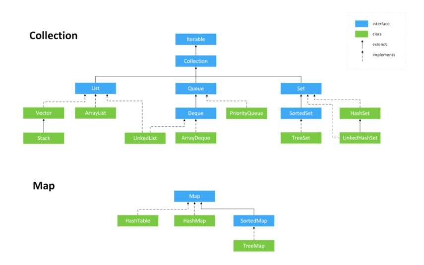

# bigDecimal
## 浮点数没有办法用二进制精确表示，因此存在精度丢失的风险。
```
float aa = 2.0f - 1.9f;
float bb = 1.8f - 1.7f;
System.out.println(aa);// 0.100000024
System.out.println(bb);// 0.099999905
System.out.println(aa == bb);// false
```
## 比较大小
a.compareTo(b) : 返回-1表示a小于b，0表示a等于b，1表示 a 大于 b。
## 常见加减乘除
```
BigDecimal a = new BigDecimal("1.0");
BigDecimal b = new BigDecimal("0.9");
System.out.println(a.add(b));// 1.9
System.out.println(a.subtract(b));// 0.1
System.out.println(a.multiply(b));// 0.90
System.out.println(a.divide(b));// 无法除尽，抛出 ArithmeticException 异常
System.out.println(a.divide(b, 2, RoundingMode.HALF_UP));// 1.11

```

# 集合
  
1. 集合接口，存放单一元素
   1. list
   2. set
   3. queue
2. map接口，存放键值对
   1. map
## 集合比较
1. comparble，对象Person实现Comparable<Person>接口，重写compareTo方法
```
    @Override
    public int compareTo(Person o) {
        return this.age-o.age;//升序；
        //return o.age-this.age;//降序
    }
```
2. comprator
```
Collections.sort(arrayList, new Comparator<Person>() {
   @Override
   public int compare(Person o1, Person o2) {
      return o1.getAge()-o2.getAge();//升序
   }
});

```

## list
特征：有序，可重复
1. arrayList，线程不安全，底层用的是object数组
2. vector，线程安全，底层用的是object数组
3. LinkedList，线程不安全，底层使用的是双向链表，JDK1.6之前为循环链表，JDK1.7取消循环
4. 总结1:arrayList扩容机制：
   1. 当容量等于0的情况，根据构造方法改变。无参构造，容量变10；传容量参数构造，当参数为0时，添加1个元素后，容量为1，再正常扩容（参数大于0则容量为当前参数大小）；传列表构造，列表为空时，添加1个元素后，容量变1，正常扩容（列表不为空则容量和传入列表长度相等）。
   2. 当容量大于0时，扩容为当前容量的1.5倍
   
## set
特征：无序、不可重复
1. hashSet，基于hashMap实现
2. LinkedHashSet，基于LinkedHashMap实现
3. TreeSet，红黑树，有序，唯一

## queue
特征：有序，可重复，add，remove，element
1. priorityQueue：优先队列，二叉堆
2. arrayQueue，数组+双指针，可实现栈
3. deque：双端队列；addFirst，addLast；removeFirst，removeLast；getFirst，getLast。提供push、pop用于模拟栈

## map
特征：键有序，不可重复；值无序、可重复
1. hashMap
   1. jdk1.8之前，有数组+链表组成，链表用于解决哈希冲突
   2. jdk1.8后，由数组+链表+红黑树组成
2. LinkedHashMap，双向链表哈希表
3. HashTable
4. TreeMap，红黑树
5. 总结1-hashMap冲突，当发生哈希冲突后，链表长度加1，当长度超过阈值时（默认为8），将链表转化为红黑树，减少搜索时间。（转换前，先检测当前数组的长度，如果当前数组的长度小于64，会先选择将数组扩容，而不是转换成红黑树）。当长度低于阈值时，会从红黑树转化成链表。
6. 总结2-hashMap使用数组（自定义2倍扩容），不使用linkedList（不能随机访问，实现O（1）查找），不使用arrayList（固定是1.5倍扩容，原因1.5 倍可以充分利用移位操作，减少浮点数或者运算时间和运算次数）。数组扩容时，同时已插入的key会rehash到新数组下标，当哈希冲突时根据头插法插入链表中，此时可能导致前后节点的链表翻转，在多进程情况下形成环，导致死循环。
7. HashMap与Hashtable的区别
   1. HashMap：数组+链表+红黑树，非线程安全、效率高、key和value可以是null（key为null只能有一个）。（1）不指定初始容量时，数组+链表，初始容量为16，每次扩容为之前的2倍（2）指定初始容量时，将其扩容为2的幂次方大小
   2. Hashtable：key和value不可以是null；如果指定了初始容量，则直接使用作为初始容量，否则初始容量为11，每次扩容变为原来的2n+1
8. 实现Hashmap线程安全
   1. 不安全的原因：多线程rehash会导致环形连接死循环
   2. 使用hashtable、使用concurrenthashMap、使用collections将hashMap包装成线程安全的map
9. concurrentHashMap与hashtable的异同：都保证线程安全
   1.  concurrentHashMap（分段锁）：jdk1.8分段数组+链表/红黑树组成；分段锁保证线程安全：jdk1.7对数组分段，每把锁只锁一部分数据，多线程访问不同段的数据；jdk1.8，使用node数组+链表+红黑树，并发控制使用synchronized（悲观锁）和cas（乐观锁）操作
   2.  hashtable（全表锁）：数组+链表组成，使用synchronized保证线程安全

## 错误机制
1. fail-fast机制
   1. 在用迭代器遍历一个集合对象时，如果遍历过程中对集合对象的结构进行了修改（增加、删除），则可能会抛出 ConcurrentModification Exception。
   2. 原理：迭代器在遍历时直接访问集合中的内容，并且在遍历过程中使用一个 modCount 变量。集合在被遍历期间如果结构发生变化，就会改变modCount 的值。每当迭代器使用 hashNext()/next()遍历下一个元素之前，都会检测 modCount 变量是否为 expectedmodCount 值，是的话就返回遍历；否则抛出异常，终止遍历。
   3. 注意：这里异常的抛出条件是检测到 modCount！=expectedmodCount这个条件。如果集合发生变化时修改 modCount 值刚好又设置为了expectedmodCount 值，则异常不会抛出。因此，不能依赖于这个异常是否抛出而进行并发操作的编程，这个异常只建议用于检测并发修改的 bug。
   4. 场景：java.util 包下的集合类都是快速失败的，不能在多线程下发生并发修改（迭代过程中被修改）。
2. fail-safe机制
   1. 采用安全失败机制的集合容器，在遍历时不是直接在集合内容上访问的，而是先复制原有集合内容，在拷贝的集合上进行遍历。
   2. 原理：由于迭代时是对原集合的拷贝进行遍历，所以在遍历过程中对原集合所作的修改并不能被迭代器检测到，所以不会触发 ConcurrentModification Exception。
   3. 缺点：基于拷贝内容的优点是避免了 Concurrent Modification Exception，但同样地，迭代器并不能访问到修改后的内容，即：迭代器遍历的是开始遍历那一刻拿到的集合拷贝，在遍历期间原集合发生的修改迭代器是不知道的。
   4. 场景：java.util.concurrent 包下的容器都是安全失败，可以在多线程下并发使用，并发修改。
## Collections工具
1. 排序操作
```
void reverse(List list)//反转
void shuffle(List list)//随机排序
void sort(List list)//按自然排序的升序排序
void sort(List list, Comparator c)//定制排序，由Comparator控制排序逻辑
void swap(List list, int i , int j)//交换两个索引位置的元素
void rotate(List list, int distance)//旋转。当distance为正数时，将list后distance个元素整体移到前面。当distance为负数时，将 list的前distance个元素整体移到后面

```
2. 查找替换操作
```
int binarySearch(List list, Object key)//对List进行二分查找，返回索引，注意List必须是有序的
int max(Collection coll)//根据元素的自然顺序，返回最大的元素。 类比int min(Collection coll)
int max(Collection coll, Comparator c)//根据定制排序，返回最大元素，排序规则由Comparatator类控制。类比int min(Collection coll, Comparator c)
void fill(List list, Object obj)//用指定的元素代替指定list中的所有元素
int frequency(Collection c, Object o)//统计元素出现次数
int indexOfSubList(List list, List target)//统计target在list中第一次出现的索引，找不到则返回-1，类比int lastIndexOfSubList(List source, list target)
boolean replaceAll(List list, Object oldVal, Object newVal)//用新元素替换旧元素

```
3. 同步控制 
```
synchronizedCollection(Collection<T>  c) //返回指定 collection 支持的同步（线程安全的）collection。
synchronizedList(List<T> list)//返回指定列表支持的同步（线程安全的）List。
synchronizedMap(Map<K,V> m) //返回由指定映射支持的同步（线程安全的）Map。
synchronizedSet(Set<T> s) //返回指定 set 支持的同步（线程安全的）set。

```
# 并发

# Java新特性


