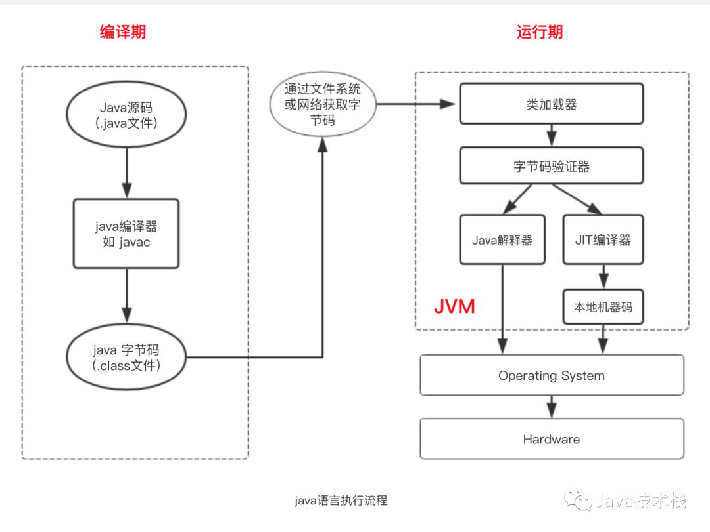
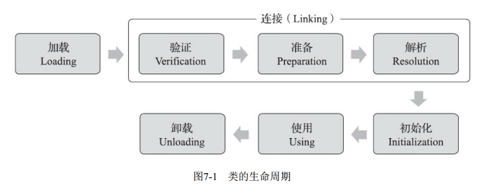
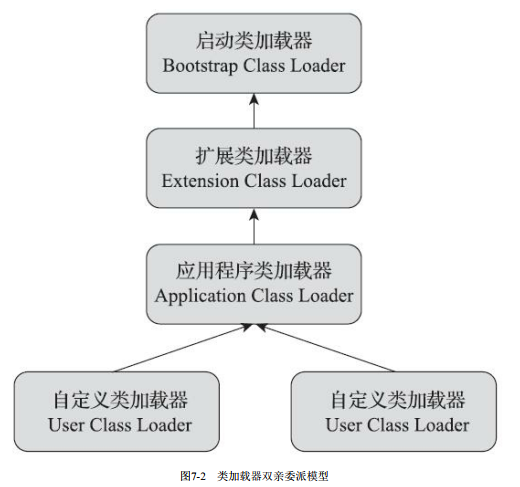
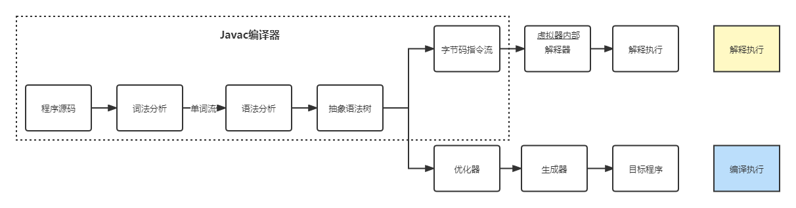
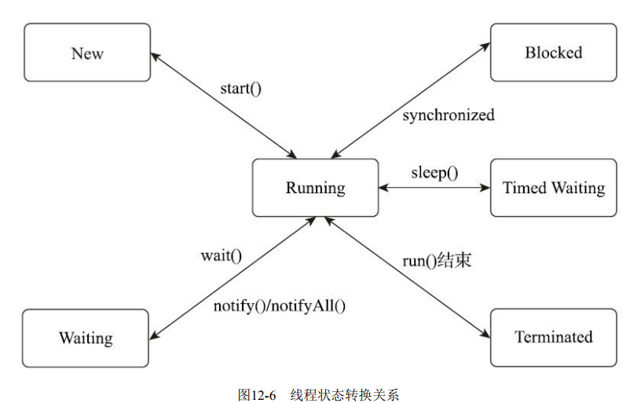
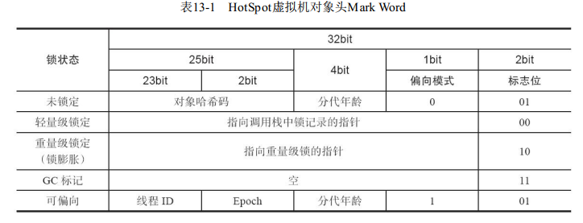
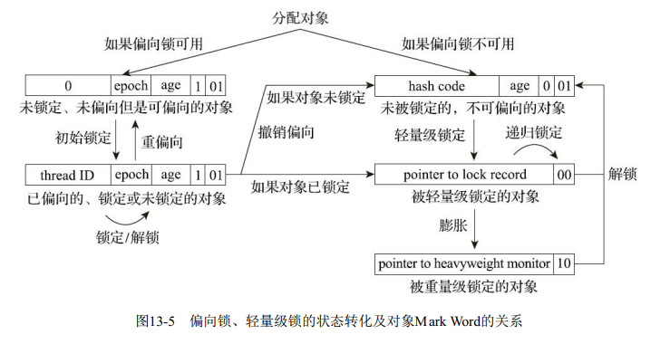
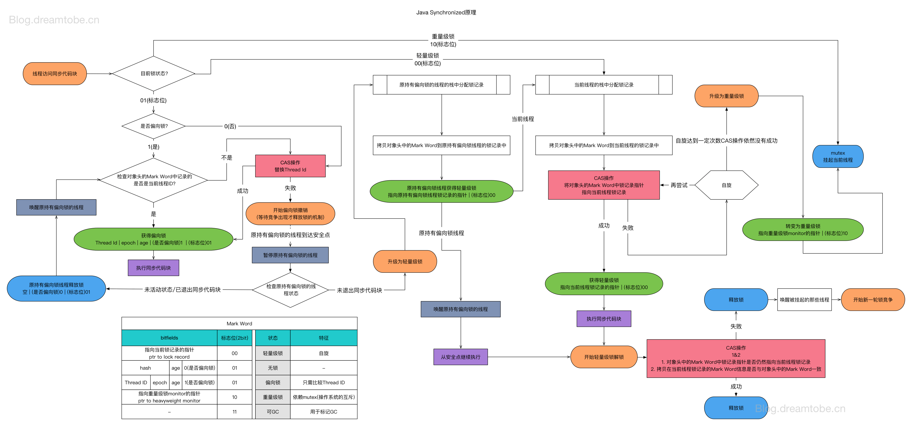

# JVM
## java 流程

```
Human human = new Man();
```
其中Human是静态类型，在编译期间就确定；Man是实际类型，在运行期间才确定
## 一、自动内存管理
### 1、运行时数据区

备注
- java方法：是由java语言编写，编译成字节码，存储在class文件中的。java方法是与平台无关的。
- 本地（native）方法：本地方法是由其他语言（如C、C++ 或其他汇编语言）编写，编译成和处理器相关的代码。

1. 线程私有
- 程序计数器 
  -  如果线程正在执行的是一个Java方法，这个计数器记录的是正在执行的虚拟机字节码指令的地址；如果正在执行的是本地方法，这个计数器值则应为空。此内存区域是唯一一个在《Java虚拟机规范》中没有规定任何OutOfMemoryError情况的区域。

- 虚拟机栈
  - 虚拟机栈描述的是Java方法执行的线程内存模型： 每个方法被执行的时候，Java虚拟机都会同步创建一个栈帧（Stack Frame） 用于存储局部变量表、操作数栈、动态连接、方法出口等信息。每一个方法被调用直至执行完毕的过程，就对应着一个栈帧在虚拟机栈中从入栈到出栈的过程
  - 局部变量表，以局部变量槽的形式存储了八种基础数据类型、对象引用类型、和returnAddress类型（指向了一条字节码指令的地址）。其中double和long占两个槽，其它占一个。
  -  如果线程请求的栈深度大于虚拟机所允许的深度，将抛出StackOverflowError异常；如果Java虚拟机栈容量可以动态扩展当栈扩展时无法申请到足够的内存会抛出OutOfMemoryError异常。

- 本地方法栈
  - 虚拟机栈为虚拟机执行Java方法（也就是字节码） 服务， 而本地方法栈则是为虚拟机使用到的本地方法服务。
  - StackOverflowError、OutOfMemoryError

2. 线程共享
- Java堆
  - 虚拟机启动时创建，存储对象的实例
  - OutOfMemoryError
- 方法区
  - 存储已被虚拟机加载的类型信息、常量、静态变量、即时编译器编译后的代码缓存等数据
  - jdk8之前永久代的概念更容易导致内存溢出的情况（MaxPermSize），jdk8之后逐渐采用本地内存的元空间实现方法区
  - OutOfMemoryError
  - 运行时常量池，用于存放编译期生成的各种字面量与符号引用，这部分内容将在类加载后存放到方法区的运行时常量池中。
### 2、直接内存
- OutOfMemoryError
- 可以使用Native函数库直接分配堆外内存，然后通过一个存储在Java堆里面的DirectByteBuffer对象作为这块内存的引用进行操作。

### 3、HotSpot虚拟机对象
#### 对象的创建
1. new过程：对象内存分配->内存空间初始化为0（保证未赋值也可以直接使用）-> 必要设置（哪个类的实例、元数据信息、对象哈希码等）-> 执行init方法（程序员自定义的初始化方法）

2. 分配对象空间：垃圾收集器是否有空间压缩整理能力决定了java堆的内存分配方式，有则使用指针碰撞，无则使用空闲列表
- 指针碰撞，堆中的内存空闲部分和非空闲部分通过指针分成两部分，每次生成新对象，则指针前进相等距离。
- 空闲列表，堆中的内存空闲部分和非空闲部分交错在一起，通过列表维护空闲内存

3. 线程安全问题
- 现象：并发情况下，正在给对象A分配内存，指针还没来得及修改，对象B又同时使用了原来的指针来分配内存的情况。
- 分配内存时同步处理，CAS+失败重试保证原子性
- 每个线程在Java堆中预先分配一小块内存，称为本地线程分配缓冲（TLAB），哪个线程要分配内存，就在哪个线程的本地缓冲区中分配，只有本地缓冲区用完了，分配新的缓存区时才需要同步锁定。

#### 对象的内存布局
1. 对象头
- 自身运行时数据：如哈希码、GC分代年龄、锁状态标志、线程持有的锁、偏向线程ID、偏向时间戳，等，这部分数据的长度在32位和64位的虚拟机（未开启压缩指针）中分别为32个比特和64个比特，官方称为“Mark Word”。
- 类型指针，Java虚拟机通过这个指针来确定该对象是哪个类的实例

2. 实例数据，对象存储的有效信息（字段内容），默认分配顺序为longs/doubles、ints、shorts/chars、bytes/booleans、oops（Ordinary
Object Pointers）

3. 对齐填充（非必须），起占位符作用，保证对象起始地址是8字节的整数倍

#### 对象的访问定位 
1. 句柄（指向java堆实例数据的指针+指向方法区类型数据的指针）
- 需划分内存存储对象的句柄地址；对象移动只需改变句柄的实例数据指针
2. 直接指针
- 对象的内存布局需考虑访问对象类型的信息；快

## 二、垃圾收集器和内存分配策略
### 回收内存  
回收Java堆和方法区的内存。程序计数器、jvm栈和本地方法栈随线程开始和结束，内存的分配和回收基本在编译期时就确定了。

### 回收java堆对象
1. 对象死去标志（不再被使用的对象）
- 引用计数法
  - 对对象添加一个计数器，每次被引用时，+1；引用失效时，-1；计数器为0时，表示不再使用
  - 不能解决循环引用问题（A引用B，B引用A）
- 可达性分析算法
  - 以根对象GC Roots集合为起始节点，根据引用关系搜索（路径成为引用链），没有引用链的对象则是不可达对象，表示不再使用
  - GC Roots集合包括：虚拟机栈中引用的对象、方法区中静态属性引用的对象、方法区中常量引用的对象、本地方法JNI引用的对象、synchronized修饰的对象等

2. 引用概念
- 强引用，代码中普遍存在的引用赋值，不会被回收，Object obj = new Object()
- 软引用，描述还有用但非必须的对象，系统发生内存溢出前，对其进行二次回收
- 弱引用，描述非必须的对象，只能存活到下一次垃圾收集
- 虚引用，为了能在这个对象被收集器回收时收到一个系统通知。一个对象是否有虚引用的存在，完全不会对其生存时间构成影响，也无法通过虚引用来取得一个对象实例。
  
3. 对象不可达，对象不一定死亡。可达性分析算法过程：
- 对象判定不可达，第一次标记 -> 判断对象有必要执行finalize()方法
  - 没有必要执行，则直接回收：对象没有覆盖finalize()方法， 或者finalize()方法已经被虚拟机调用过
  - 有必要执行：将对象放入F-Queue中，由jvm自动建立的、低调度优先级的Finalizer线程执行它们的finalize()方法
  - 此时对象可达则不会被回收；否则第二次标记被回收
- 对象只能拯救自己一次，finalize()方法只能被系统调用一次

### 回收方法区
1. 回收的目标
- 废弃的常量，类似回收java堆中的对象
- 不再使用的类型
  - 判断该类所有实例被回收
  - 加载该类的类加载器被回收
  - 该类对应的java.lang.Class对象没有被引用，无法通过反射访问该类的方法
  - 满足上述三个条件的类允许被回收，不一定会被回收

### 垃圾收集算法
1. 追踪式垃圾收集（主要）、引用计数式垃圾收集
2. 分代收集理论
   1. 名词解释：java堆可分为新生代、老年代：在新生代中，每次垃圾收集时都发现有大批对象死去，而每次回收后存活的少量对象，将会逐步晋升到老年代中存放。
      1. 新生代收集（Minor GC/Young GC） 
      2. 老年代收集（Major GC/Old GC）：指目标只是老年代的垃圾收集。目前只有CMS收集器会有单独收集老年代的行为。
      3. 混合收集（Mixed GC）：指目标是收集整个新生代以及部分老年代的垃圾收集。目前只有G1收集器会有这种行为。
      4. 整堆收集（Full GC）：收集整个Java堆和方法区的垃圾收集。
   2. 弱分代，大多数对象都是朝生夕灭的。保留少量存活对象而不是标记大量被回收对象
   3. 强分代，熬过越多次垃圾收集过程的对象就越难以消亡。收集难以消亡的对象到一起，以较低频率回收
   4. 跨代引用：跨代引用相对于同代引用来说仅占极少数
      1. 在新生代建立全局数据结构记忆集，将老年代划分若干块，并标记哪一块内存存在跨代引用。避免了当仅收集新生代时，需要遍历老年代对象对新生代对象的可达引用

3. 标记-清除算法
   1. 先标记，再清除
   2. 执行效率不稳定；内存空间碎片化严重

4. 标记-复制算法
   1. 将分区分成相等两部分，当一部分内存用完了，将存活的对象复制到另一块，再将当前块的内存清理
   2. 简单；空间浪费了一半

5. 标记-整理算法
    1. 标记对象
    2. 让存活对象向内存空间一端移动，清理边界外的内存
    3. 移动对象花费代价

### HostSpot算法细节
1. 根节点枚举，由于对象引用不断变化，必须暂停用户进程
2. 安全点
- jvm通过OopMap找到对象引用位置，而不是检查所有执行上下文和全局引用位置。
- jvm只在特定位置（安全点）生成OopMap
  - 抢先式中断
  - 主动式中断

3. 安全区域
- 安全区域是指能够确保在某一段代码片段之中，引用关系不会发生变化，因此，在这个区域中任意地方开始垃圾收集都是安全的。我们也可以把安全区域看作被扩展拉伸了的安全点。
- 用户线程处于sleep状态或blocked状态，线程无法响应虚拟机的中断请求，不能到达安全点中断挂起自己  

4. 记忆集和卡表
- 记忆集是一种用于记录从非收集区域指向收集区域的指针集合的抽象数据结构。 
- 为解决对象跨代引用所带来的问题，垃圾收集器在新生代中建立了名为记忆集的数据结构，用以避免把整个老年代加进GC Roots扫描范围。 
- 三种精度实现方案
  - 字长精度，每个记录精确到机器字长，该字含有跨代指针
  - 对象精度，每个记录精确到一个对象，该对象里有字段含有跨代指针。
  - 卡精度，卡表。每个记录精确到一块内存区域，该区域内有对象含有跨代指针。
    - 卡页，节数组CARD_TABLE（卡表最简单形式）的每一个元素都对应着其标识的内存区域中一块特定大小的内存块，这个内存块被称作“卡页”（Card Page） 
    - 当卡页内有一个对象存在跨代指针，则将卡表对于数组元素置为1，表示脏。垃圾回收时，筛选卡表中变脏的元素，将其加入GC Roots扫描。

- 卡表元素维护问题

- 伪共享问题
  - 伪共享是处理并发底层细节时一种经常需要考虑的问题，现代中央处理器的缓存系统中是以缓存行（Cache Line）为单位存储的，当多线程修改互相独立的变量时，如果这些变量恰好共享同一个缓存行，就会彼此影响（写回、无效化或者同步）而导致性能降低。

5. 写屏障
- 解决卡表元素维护问题

6. 并发可达性分析
- 收集线程和用户线程并发时，可能出现将存活对象标记为死亡
- 解决并发扫描时对象消失问题
  - 产生条件
    - 赋值器插入了一条或多条从黑色对象（扫描结束）到白色对象的新引用
    - 赋值器删除了全部从灰色对象（正在扫描，未扫描完）到该白色对象（未扫描）的直接或间接引用
  - 增量更新，破坏的是第一个条件，当黑色对象插入新的指向白色对象的引用关系时， 就将这个新插入的引用记录下来，等并发扫描结束之后，再将这些记录过的引用关系中的黑色对象为根，重新扫描一次。这可以简化理解为，黑色对象一旦新插入了指向白色对象的引用之后，它就变回灰色对象了。
  - 原始快照，破坏的是第二个条件，当灰色对象要删除指向白色对象的引用关系时，就将这个要删除的引用记录下来，在并发扫描结束之后，再将这些记录过的引用关系中的灰色对象为根，重新扫描一次。这也可以简化理解为，无论引用关系删除与否，都会按照刚刚开始扫描那一刻的对象图快照来进行搜索


### 经典垃圾收集器
1. Serial收集器，单进程收集器
2. ParNew收集器，多线程并行收集器
3. Parallel Scavenge收集器，新生代收集器，标记-复制
4. Serial Old收集器，Serial收集器老年代版本，基于标记-整理
5. Parallel Old收集器是Parallel Scavenge收集器的老年代版本，支持多线程并发收集，基于标记-整理算法实现
6. CMS收集器，基于标记-清除，分代收集
   1. 初始标记，标记GC Roots直接关联到的对象；需要暂停其它线程
   2. 并发标记，从GC Roots直接关联到的对象搜索间接关联的对象，可以和垃圾收集线程并发运行
   3. 重新标记，修正并发标记期间，产生变动的标记对象；需要暂停其它线程
   4. 并发清除，清除死亡对象
   5. 缺点
      1. 对处理器资源敏感
      2. 无法处理浮动垃圾（并发标记和并发清理产生的垃圾对象）
      3. 空间碎片
   6. 收集线程与用户线程互不干扰：增量更新算法
   7. jdk9被舍弃
7. Garbage First收集器，整体标记-整理，局部region标记-复制，MixedGC
   1. 基于region内存布局，将java堆划分为多个大小相等的独立区域，每个区域都可以是新生代或老年。G1收集器追踪每个region垃圾的价值大小（价值即回收所获得的空间大小以及回收所需时间的经验值），维护一个优先级列表，优先处理回收价值最大的region。可以指定最大停顿时间。动态确定回收集。  
   2. 跨regin引用问题：通过记忆集避免GC Roots扫描。每个region维护自己的记忆集，记录其它region指向自己的指针  
   3. 收集线程与用户线程互不干扰：原始快照SATB算法。G1收集器为每个region分配两个TAMS指针，将region一部分空间划分处理并发回收时产生的新对象，其地址在两个指针以上，默认是存活的
   4. humongous region：存放大对象，直接进入老年代
   5. 过程
      1. 初始标记，标记GC Roots能直接关联到的对象，并且修改TAMS指针的值
      2. 并发标记，从GC Root开始对堆中对象进行可达性分析，找出要回收的对象，扫描结束后重新处理SATB记录下的在并发时有引用变动的对象
      3. 最终标记，对用户线程做另一个短暂的暂停，用于处理并发阶段结束后仍遗留下来的最后那少量的SATB记录。
      4. 筛选回收，负责更新Region的统计数据，对各个Region的回收价值和成本进行排序，根据用户所期望的停顿时间来制定回收计划，可以自由选择任意多个Region构成回收集，然后把决定回收的那一部分Region的存活对象复制到空的Region中，再清理掉整个旧Region的全部空间。这里的操作涉及存活对象的移动，是必须暂停用户线程，由多条收集器线程并行完成的。
8. CMS、G1比较
- 都是要卡表处理跨代指针，G1更加复杂，每个region都需有一份卡表（其它region引用该region）；CMS只需要处理老年代对新生代的引用，新生代建立一份全局的卡表
- 并发对象可达性问题，G1原始快照；CMS增量更新
- 都使用写（后）屏障维护卡表，CMS同步处理写屏障；G1将G1为了实现快照搜索算法还需要写前屏障跟踪并发时指针变化情况。同时把写前屏障和写后屏障中要做的事情都放到队列里，然后再异步处理。

### 低延迟垃圾收集器，非分代收集
1. 衡量垃圾收集器的指标：内存占用、吞吐量和延迟
2. Shenandoah收集器，与G1的不同
   1. 采用并发的整理标记，G1的筛选回收可以收集线程多线程并发，但不能和用户线程并发
   2. 不使用分代收集
   3. 连接矩阵代替记忆集
   4. 过程如下
      1. 初始标记，同G1
      2. 并发标记，同G1
      3. 最终标记，同G1
      4. 并发清理，清理无存活对象的region
      5. 并发回收（核心区别），将回收集的存活对象复制到未被使用的region。读屏障和brooks pointers转发指针解决复制问题（移动对象同时，用户线程可能需要读写该对象）
      6. 初始引用更新，并发复制对象结束后，建立线程集合点，确保对象移动已完成
      7. 并发引用更新，与用户线程并发，按照内存物料地址顺序，搜索引用类型，更新指向对象的引用地址
      8. 最终引用更新，解决了堆中的引用更新后，还要修正存在于GC Roots中的引用。这个阶段是Shenandoah的最后一次停顿，停顿时间只与GC Roots的数量相关
      9. 并发清理，回收region内存空间
    5. 转发指针
       1. 在原有对象布局结构的最前面统一增加一个新的引用字段，在正常不处于并发移动的情况下，该引用指向对象自己
       2. 通过CAS保证并发时对象的正确访问（存在进程竞争）
    6. 读屏障，类似写屏障
       1. 所谓“引用访问屏障”是指内存屏障只拦截对象中数据类型为引用类型的读写操作，而不去管原生数据类型等其他非引用字段的读写，这能够省去大量对原生类型、对象比较、对象加锁等场景中设置内存屏障所带来的消耗。

3. ZGC收集器，
   1. region类型
      1. 小型，2MB
      2. 中型，32MB
      3. 大型，动态变化，2MB整数倍
   2. 核心，并发整理算法
      1. 读屏障
      2. 染色指针，将少量额外信息存储在指针上


## 三、虚拟机执行子系统
### 类文件结构
1. java程序经过javac编译器，变成字节码(.class文件)，运行在java虚拟机上
2. CLass类文件的结构
- 任何一个Class文件都对应着唯一的一个类或接口的定义信息。Class文件是一组以8个字节为基础单位的二进制流，各个数据项目严格按照顺序紧凑地排列在文件之中，中间没有添加任何分隔符。
   1. 魔数，每个class文件的头四个字节，作用是确定这个文件是否为一个能被虚拟机接受的Class文件。
   2. Class文件版本号，紧接着魔数后的四个字节。第5和第6个字节是次版本号（Minor Version），第7和第8个字节是主版本号（Major Version）。
   3. 常量池入口，常量池存放字面量和符号引用
   4. 访问标志，2个字节。用于识别一些类或者接口层次的访问信息，包括：这个Class是类还是接口；是否定义为public类型； 是否定义为abstract类型；如果是类的话，是否被声明为final等等。
   5. 类索引、父类索引与接口索引集合。Class文件中由这三项数据来确定该类型的继承关系。类索引用于确定这个类的全限定名， 父类索引用于确定这个类的父类的全限定名。 
   6. 字段表集合，用于描述接口或者类中声明的变量。访问标志、名称索引、描述符索引、属性表集合。
      1. 包括类级变量以及实例级变量， 但不包括在方法内部声明的局部变量。
      2. 字段的作用域（public、private、protected修饰符 、是实例变量还是类变量（static修饰符）、可变性（final）、并发可见性（volatile修饰符，是否强制从主内存读写）、可否被序列化（transient修饰符）、字段数据类型（基本类型、对象、数组）、字段名称。 
   7. 方法表集合，用于描述接口或者类中声明的方法。访问标志（区别）、名称索引、描述符索引、属性表集合（区别）
      1. volatile关键字和transient关键字不能修饰方法
      2. synchronized、native、strictfp和abstract关键字可以修饰方法
   8. 属性表集合
      1. code属性，Java程序方法体里面的代码经过Javac编译器处理之后， 最终变为字节码指令存储在Code属性内。
      2. 。。。
3. 字节码指令
   1. Java虚拟机的指令由一个字节长度的、代表着某种特定操作含义的数字（称为操作码，Opcode）以及跟随其后的零至多个代表此操作所需的参数（称为操作数，Operand）构成。
   2. 基本流程如下
   ```
   do {
      自动计算PC寄存器的值加1;
      根据PC寄存器指示的位置， 从字节码流中取出操作码;
      if (字节码存在操作数) 从字节码流中取出操作数;
      执行操作码所定义的操作;
    } while (字节码流长度 > 0);
  
   ```
   3. 字节码与数据类型
      1. 加载、存储
      2. 运算
      3. 类型转换
      4. 对象创建和访问
      5. 控制转移
      6. 方法调用
      7. 异常处理
      8. 同步
      9. 操作数栈

    4. 公有设计，私有实现

### 虚拟机加载机制
#### 类加载的时机
1. Java虚拟机把描述类的数据从Class文件加载到内存，并对数据进行校验、转换解析和初始化，最终形成可以被虚拟机直接使用的Java类型，这个过程被称作虚拟机的类加载机制。 

2. 其中加载、验证、准备、初始化、卸载五个顺序是确定的。
3. 解析阶段不一定，为了支持动态绑定，可能会初始化阶段再开始
4. 类主动初始化的六种情况
   1. 遇到new、getstatic、putstatic或invokestatic这四条字节码指令时，如果类型没有进行过初始化，则需要先触发其初始化阶段。能够生成这四条指令的典型Java代码场景有：
      1. 使用new关键字实例化对象的时候。
      2. 读取或设置一个类型的静态字段（被final修饰、 已在编译期把结果放入常量池的静态字段除外）的时候。
      3. 调用一个类型的静态方法的时候。
   2. 使用java.lang.reflect包的方法对类型进行反射调用的时候，如果类型没有进行过初始化，则需要先触发其初始化。
   3. 当初始化类的时候，如果发现其父类还没有进行过初始化，则需要先触发其父类的初始化。
   4. 当虚拟机启动时，用户需要指定一个要执行的主类（ 包含main()方法的那个类），虚拟机会先初始化这个主类。
   5. 当使用JDK 7新加入的动态语言支持时，如果一个java.lang.invoke.MethodHandle实例最后的解析结果为REF_getStatic、 REF_putStatic、REF_invokeStatic、REF_newInvokeSpecial四种类型的方法句柄，并且这个方法句柄对应的类没有进行过初始化，则需要先触发其初始化。
   6. 当一个接口中定义了JDK 8新加入的默认方法（ 被default关键字修饰的接口方法）时，如果有这个接口的实现类发生了初始化，那该接口要在其之前被初始化。
5. 接口主动初始化，与类主动初始化大部分相同
- 区别在第三种：一个接口在初始化时，并不要求其父接口全部都完成了初始化，只有在真正使用到父接口的时候（如引用接口中定义的常量）才会初始化。
#### 类加载的过程
1. 加载
   1. 通过一个类的全限定名来获取定义此类的二进制字节流
   2. 将这个字节流所代表的静态存储结构转化为方法区的运行时数据结构
   3. 在内存中生成一个代表这个类的java.lang.Class对象，作为方法区这个类的各种数据访问入口
2. 验证，确保class文件的字节流中包含的信息符合约束要求
   1. 文件格式验证，验证字节流是否符合Class文件格式的规范，并且能被当前版本的虚拟机处理
   2. 元数据验证（数据类型），对类的元数据信息进行语义校验
   3. 字节码验证（类的方法体），通过数据流分析和控制流分析，确定程序语义是合法的、符合逻辑的。
   4. 符合引用验证，在解析时发生。对类自身以外（常量池中的各种符号引用）的各类信息进行匹配性校验
3. 准备，为类中定义的变量（即静态变量，被static修饰的变量）分配内存并设置类变量初始值的阶段。
   1. 这个阶段只为类变量分配内存，实例变量需要初始化时分配内存
   2. 如果类变量未被final修饰，初始化为0值；否则初始化设定的值
4. 解析，Java虚拟机将常量池内的符号引用替换为直接引用的过程
   1. 符号引用：以一组符号来描述所引用的目标，符号可以是任何形式的字面量，只要使用时能无歧义地定位到目标即可。符号引用与虚拟机实现的内存布局无关，引用的目标并不一定是已经加载到虚拟机内存当中的内容。各种虚拟机实现的内存布局可以各不相同，但是它们能接受的符号引用必须都是一致的，因为符号引用的字面量形式明确定义在《Java虚拟机规范》的Class文件格式中。
   2. 直接引用：是可以直接指向目标的指针、相对偏移量或者是一个能间接定位到目标的句柄（实际运行时的内存布局入口地址）。直接引用是和虚拟机实现的内存布局直接相关的，同一个符号引用在不同虚拟机实例上翻译出来的直接引用一般不会相同。如果有了直接引用，那引用的目标必定已经在虚拟机的内存中存在。
5. 初始化
   1. 根据代码初始化类变量和其它资源，初始化阶段就是执行类构造器<clinit>()方法的过程。
   2. <clinit>()方法是由编译器自动收集类中的所有类变量的赋值动作和静态语句块（static{}块）中的语句合并产生的，编译器收集的顺序是由语句在源文件中出现的顺序决定的，静态语句块中只能访问到定义在静态语句块之前的变量，定义在它之后的变量，静态语句块可以赋值，不能访问
#### 类加载器，实现类加载的一段代码
1. 让应用程序自己决定如何获取所需的类，然后“通过一个类的全限定名来获取描述该类的二进制字节流（加载的第一阶段）”
2. 类加载器+类本身共同确立类在jvm中的唯一性
   1. 判断两个类相等(equal()、isINstance()的结果)，需要判断加载类的加载器是否相同
3. 双亲委派模型
   1. 三层类加载器
      1. 启动类加载器(Bootstrap ClassLoader)，这个类加载器使用C++语言实现，是虚拟机自身的一部分。负责加载存放在<JAVA_HOME>\lib目录。
      2. 其它的类加载器，这些类加载器都由Java语言实现，独立存在于虚拟机外部，并且全都继承自抽象类java.lang.ClassLoader。
         1. 扩展类加载器，负责加载<JAVA_HOME>\lib\ext目录中，或者被java.ext.dirs系统变量所指定的路径中所有的类库
         2. 应用类加载器，加载用户类路径（ClassPath）上所有的类库
   2. 双亲委派模型
   
   3. 双亲委派模型过程
      1. 如果一个类加载器收到了类加载的请求，它首先不会自己去尝试加载这个类，而是先判断是否加载过这个类，未加载过则把这个请求委派给父类加载器去完成，每一个层次的类加载器都是如此，因此所有的加载请求最终都应该传送到最顶层的启动类加载器中，只有当父加载器反馈自己无法完成这个加载请求（它的搜索范围中没有找到所需的类）时，子加载器才会尝试自己去完成加载。
      2. 好处：无论哪一个类加载器要加载一个类，最终都是委派给处于模型最顶端的启动类加载器进行加载，因此这个类在程序的各种类加载器环境中都能够保证是同一个类。
   4. 模块化系统
      1. 实现可配置的封装隔离机制
      2. 类路径，ClassPath查找依赖
      3. 模块路径
      4. 平台类加载器代替扩展类加载器

### 虚拟机字节码执行引擎
1. 执行引擎在执行字节码的时候，通常会有解释执行（通过解释器执行）和编译执行（通过即时编译器产生本地代码执行）两种选择，也可能两者兼备 
   1. 解释执行：通过专门的编译器，将源代码（此处为字节码）一次性转换成机器码，形成目标程序
      1. 效率高，移植性差
   2. 编译执行：通过专门的解释器，将源码代码解释一句执行一句，不形成目标程序
      1. 跨平台性好，效率低

#### 运行时栈帧结构
1. java虚拟机以方法作为最基本的执行单元，“栈帧”（Stack Frame）则是用于支持虚拟机进行方法调用和方法执行背后的数据结构，它也是虚拟机运行时数据区中的虚拟机栈（Virtual Machine Stack）中栈的存储元素。
2. 每个栈帧包括了局部变量表、操作数栈、动态连接、方法返回地址和一些额外的附加信息
   1. 局部变量表：以变量槽为最小单位。
      1. 虚拟机通过索引定位的方式使用局部变量表
      2. boolean、byte、char、short、int、float、reference（对象实例的引用）和returnAddress（指向字节码指令地址）占用一个槽；
      3. long、double占用两个槽。
   2. 操作数栈
   3. 动态连接
      1. 每个栈帧都包含一个指向运行时常量池中该栈帧所属方法的引用，持有这个引用是为了支持方法调用过程中的动态连接（Dynamic Linking）。
      2. Class文件的常量池中存有大量的符号引用，字节码中的方法调用指令就以常量池里指向方法的符号引用作为参数。这些符号引用一部分会在类加载阶段或者第一次使用的时候就被转化为直接引用，这种转化被称为静态解析。另外一部分将在每一次运行期间都转化为直接引用，这部分就称为动态连接。
   4. 方法返回地址
      1. 方法正常退出，返回PC计数器值
      2. 异常退出，无匹配的异常处理器，返回到调用位置，返回地址由异常处理器表决定
   5. 附加信息
      1. 调试、性能收集等
3. 方法调用
   1. 方法调用是确定被调用方法的版本（调用哪一个方法），不执行方法中的代码。
   2. Class文件的编译过程中不包含传统程序语言编译的连接步骤，一切方法调用在Class文件里面存储的都只是符号引用，而不是方法在实际运行时内存布局中的入口地址（也就是之前说的直接引用）。
   3. 解析调用
      1. 是个静态的过程，在编译期间就完全确定，在类加载的解析阶段就会把涉及的符号引用全部转变为明确的直接引用，不必延迟到运行期再去完成
      2. 调用目标在程序代码写好、编译器进行编译那一刻就已经确定下来。这类方法的调用被称为解析
      3. 编译期可知，运行期不可变：静态方法、私有方法。在类加载阶段进行解析
   4. 分派调用
  
```
Human human = new Man();
```  
其中Human是静态类型，在编译期间就确定；Man是实际类型，在运行期间才确定  
- 静态分派，依赖静态类型来决定方法执行版本的分派动作，发生在编译阶段
   1. 重载，参数类型、数量、顺序不同，与返回类型无关
- 动态分派，在运行期根据实际类型确定方法执行版本的分派过程（不考虑参数，只考虑方法接受者），在运行阶段
  1. 重写：方法名，参数列表，返回类型都相同，且子类的访问域不小于父类
  2. 虚方法调用指令invokvirture的逻辑决定了多态性只对方法有效，对字段无效
     1. 找到操作数栈顶的第一个元素所指向的对象的实际类型，记作C。
     2. 如果在类型C中找到与常量中的描述符合简单名称都相符的方法，则进行访问权限校验，如果通过则返回这个方法的直接引用，查找过程结束；不通过则返回java.lang.IlleagalAccessError异常。
     3. 否则，按照继承关系从下往上依次对C的各个父类进行第二步的搜索和验证过程。
     4. 如果始终没有找到合适的方法，则抛出java.lang.AbstractMethodError异常。
- 方法的接收者（调用者）与方法的参数统称为方法的宗量
  1. 单分派是根据一个宗量对目标方法进行选择
  2. 多分派则是根据多于一个宗量对目标方法进行选择，（方法的调用者或方法参数都是new出来的）
```
public class Dispatch {
    static class QQ {}
    static class _360 {}
    public static class Father {
        public void hardChoice(QQ arg) {
            System.out.println("father choose qq");
        } 
        public void hardChoice(_360 arg) {
            System.out.println("father choose 360");
        }
    }

    public static class Son extends Father {
        public void hardChoice(QQ arg) {
            System.out.println("son choose qq");
        } 
        public void hardChoice(_360 arg) {
            System.out.println("son choose 360");
        }
    } 

    public static void main(String[] args) {

        Father father = new Father();
        father.hardChoice(new _360());
        //输出 father choose 360，
        Father son = new Son();
        son.hardChoice(new QQ());
        //输出 son choose qq，（先根据实际类型确定类，再根据参数静态类型确定方法）

        //两次调用hardChoice时，在编译阶段，静态分配过程需判断father（或son）静态类型是Father还是Son，方法参数是QQ还是360。java是静态多分派语言
        //执行“son.hardChoice(new QQ())”时，运行阶段，动态分配过程只需判断方法参数是QQ还是360。java是动态单分派语言
    }
}
```
- 虚方法表
   1. Java虚拟机实现基于执行性能的考虑，真正运行时一般不会如此频繁地去反复搜索类型元数据。面对这种情况，一种基础而且常见的优化手段是为类型在方法区中建立一个虚方法表。虚方法表中存放着各个方法的实际入口地址。
   2. 如果某个方法在子类中没有被重写，那子类的虚方法表中的地址入口和父类相同方法的地址入口是一致的，都指向父类的实现入口。如果子类中重写了这个方法，子类虚方法表中的地址也会被替换为指向子类实现版本的入口地址。
#### 基于栈的字节码的解释执行引擎

1. java是半解释性执行，将部分步骤实现为一个半编译器（javac）
  

## 程序编译和代码优化
### 前端后端
1. 前端优化：将源代码编译成中间代码的过程（.java->.class)，前端编译器javac
2. 后端优化：将中间代码编译成二进制代码（.class->二进制代码）
   1. 即时编译器，运行期触发优化的后端编译器（客户端、服务端）（动态优化）
   2. 提前编译器，运行前优化的后端编译器（静态优化）
### 前端编译和优化
1. 编译器
   1. 前端编译器（javac），把*.java文件转变成*.class文件（编译过程）。需要java解释器解释成本地机器码（只有解释器才能识别.class文件）
   2. 即时编译器（JIT），运行期把字节码转变成本地机器码（处理热点代码）
   3. 提前编译器，在程序运行之前把程序编译成与目标机器指令集相关的二进制代码 
   4. 客户端编译器、服务端编译器
2. Javac编译器
   1. 编译过程
      1. 准备过程：初始化插入式注解处理器
      2. 解析与填充符号表过程
         1. 词法分析，将源代码字符流转变为标记集合；语法分析，根据标记构造出抽象语法树
         2. 填充符号表。产生符号地址和符号信息
      3. 插入式注解处理器的注解处理过程：插入式注解处理器的执行阶段。
         1. 注解处理器，可以提前至编译期对代码中的特定注解进行处理的代码
         2. 如果产生新的符号，就必须转回到之前的解析、填充符号表的过程中重新处理这些新符号
      4. 语义分析与字节码生成过程
         1. 标注检查。 对语法的静态信息进行检查。
         2. 数据流及控制流分析。 对程序动态运行过程进行检查。
         3. 解语法糖。 将简化代码编写的语法糖还原为原有的形式。
            1. 泛型、变长参数、自动拆箱装箱等
         4. 字节码生成。 将前面各个步骤所生成的信息转化成字节码。
            1. 把前面各个步骤所生成的信息（语法树、 符号表）转化成字节码指令写到磁盘中，还进行了少量的代码添加和转换工作。
   2. 语法糖
      1. 泛型
         1. 参数化类型或者参数化多态的应用，泛型类，泛型接口，泛型方法。
         2. 方法
            1. java，类型擦除式泛型，只存在于代码中，在编译后的字节码文件中，全部泛型都被替换为原来的裸类型（Raw Type）了。并且在相应的地方插入了强制转型代码，因此对于运行期的Java语言来说，ArrayList<int>与ArrayList<String>其实是同一个类型。 
            2. C#，具现化式泛型
         3. 裸类型（Raw Type），所有该类型泛型化实例的共同父类型（Super Type）
          ```
         ArrayList<String> slist = newArrayList<String>();
         ArrayList list; // 裸类型
         ```
   
         1. 类型擦除
            1. 不支持基本数据类型与object类型的强制转型
            2. 运行期无法取到泛型类型信息
            3. 泛型和重载一起，无法编译（但是返回类型不同时，仍然可以编译运行，因为可以共存在一个class文件中）
      2. 自动装箱、拆箱、遍历循环
         1. 自动装箱陷阱
         ```
         Integer a = 1;
         Integer b = 2;
         Integer c = 3;
         Integer d = 3;
         Integer e = 321;
         Integer f = 321;
         Long g = 3L;
         Long h = 2L;
         Double i = 1.0;
         Double j = 1.0;
         System.out.println(i == j);#false
         System.out.println(c == d);#true
         System.out.println(e == f);#false
         #基本类型的包装类常量池在-128~127之间，float、double包装类无常量池，无论传入什么值，都会new一个对象
         System.out.println(c == (a + b));#true，c拆箱为int
         System.out.println(c.equals(a + b));#true，(a+b)传入equals()方法，转换成Integer
         System.out.println(g == (a + b));#true，g拆箱
         System.out.println(g.equals(a + b));#false，(a+b)传入equals()方法，转换成Integer
         包装类的“==”运算在不遇到算数运算时，不会自动拆箱以及它们equals()方法不处理数据转型的关系
         包装类对象重写了equals()方法，先判断类型是否相等，再看内容是否相等
         System.out.println(g.equals(a+h)); #true，(a+h)传入equals()方法，转换成Long
         ```
      3. 条件编译
         1. 编译器将会把分支中不成立的代码块消除掉，这一工作将在编译器解除语法糖阶段完成
      4. 变长参数、内部类、枚举类、断言语句、数值字面量、对枚举和字符串的switch支持、try语句中定义和关闭资源、Lambda表达式

### 后端编译和优化
1. 即时编译器，将频繁调用的方法或代码块（热点代码）编译成本地机器码，并进行优化的后端编译器
   1. 解释器与编译器
      1. 解释器可以立即运行，省去编译的时间
      2. 编译器一次性将代码编译成本地代码，减少解释器的中间损耗，获得更高的执行效率，占用内存大
   2. 热点代码：频繁调用的方法或代码块
      1. 被多次调用的方法
      2. 被多次执行的循环体，此时循环体的方法也是编译的目标对象
      3. 热点探测：判断热点代码的方式
         1. 基于采样的热点探测，采用这种方法的虚拟机会周期性地检查各个线程的调用栈顶，如果发现某个（或某些） 方法经常出现在栈顶，那这个方法就是“热点方法”。
         2. 基于计数器的热点探测，采用这种方法的虚拟机会为每个方法（甚至是代码块）建立计数器，统计方法的执行次数，如果执行次数超过一定的阈值就认为它是“热点方法”。
   3. 编译过程
      1. 客户端编译器
         1. 一个平台独立的前端将字节码构造成一种高级中间代码表示（HIR，即与目标机器指令集无关的中间表示）
         2. 一个平台相关的后端从HIR中产生低级中间代码表示（LIR，即与目标机器指令集相关的中间表示）
         3. 在平台相关的后端使用线性扫描算法在LIR上分配寄存器，并在LIR上做窥孔（Peephole）优化，然后产生机器代码。
      2. 服务端编译器
         1. 是专门面向服务端的典型应用场景，并为服务端的性能配置针对性调整过的编译器，也是一个能容忍很高优化复杂度的高级编译器
         2. 执行大部分经典的优化动作，如：无用代码消除、循环展开、循环表达式外提、消除公共子表达式、常量传播、基本块重排序等，
         3. 实施一些与Java语言特性密切相关的优化技术，如范围检查消除、空值检查消除，不过并非所有的空值检查消除都是依赖编译器优化的，有一些是代码运行过程中自动优化了）等。
         4. 根据解释器或客户端编译器提供的性能监控信息，进行一些不稳定的预测性激进优化，如守护内联、分支频率预测等
2. 提前编译器
3. 编译器优化技术
   1. 方法内联（最重要），
      1. 类型继承关系分析技术解决虚方法的内联问题
   2. 逃逸分析
      1. 分析对象动态作用域，当一个对象在方法里面被定义后，它可能被外部方法所引用，例如作为调用参数传递到其他方法中，这种称为方法逃逸；甚至还有可能被外部线程访问到，譬如赋值给可以在其他线程中访问的实例变量 这种称为线程逃逸；从不逃逸、方法逃逸到线程逃逸，称为对象由低到高的不同逃逸程度
         1. 栈上分配，解决方法逃逸
         2. 标量替换
         3. 同步消除
   3. 公共子表达式消除
   4. 数组边界检查消除
   5. 等

## java并发
### Java内存模型与线程
1. 主内存与工作内存，与java内存区域中堆栈方法区不是一个层次的划分
   1. 所有变量存储在主内存中
   2. 每个线程有自己的工作内存，保存了被该线程使用的变量的主内存副本，线程对变量的所有操作（读取、 赋值等） 都必须在工作内存中进行，而不能直接读写主内存中的数据
   3. 不同线程间变量值的传递均需要通过主内存来完成
   4. 内存间交互操作（主内存与工作内存），八种操作
      1. lock（锁定）：作用于主内存的变量，它把一个变量标识为一条线程独占的状态。
      2. unlock（解锁）：作用于主内存的变量，它把一个处于锁定状态的变量释放出来，释放后的变量才可以被其他线程锁定。
      3. read（读取）：作用于主内存的变量，它把一个变量的值从主内存传输到线程的工作内存中，以便随后的load动作使用。
      4. load（载入）：作用于工作内存的变量，它把read操作从主内存中得到的变量值放入工作内存的变量副本中。
      5. use（使用）：作用于工作内存的变量，它把工作内存中一个变量的值传递给执行引擎，每当虚拟机遇到一个需要使用变量的值的字节码指令时将会执行这个操作。
      6.  assign（赋值）：作用于工作内存的变量，它把一个从执行引擎接收的值赋给工作内存的变量，每当虚拟机遇到一个给变量赋值的字节码指令时执行这个操作。
      7.  store（存储）：作用于工作内存的变量，它把工作内存中一个变量的值传送到主内存中，以便随后的write操作使用。
      8.  write（写入）：作用于主内存的变量，它把store操作从工作内存中得到的变量的值放入主内存的变量中。
   5. volatile关键字
      1. 修改后，新值能立即同步到主内存， 以及每次使用前立即从主内存刷新
      2. 可见性：一条线程修改了被volatile修饰的变量时，其它线程立即得知这个信息（不能保证原子性，所以在并发条件下仍然不安全）
      3. 禁止指令重排序优化，相当于多了一个内存屏障，重排序时不能把后面的指令重排序到内存屏障之前的位置
   6. long、double型变量
      1. 允许虚拟机将没有被volatile修饰的64位数据的读写操作划分为两次32位的操作来进行，即允许虚拟机实现自行选择是否要保证64位数据类型的load、store、read和write这四个操作的原子性，这就是所谓的“long和double的非原子性协定”。
   7. 原子性、可见性、有序性
      1. 原子性：六个原子操作read、 load、 assign、 use、 store和write；synchronized关键字
      2. 可见性: volatile关键字
      3. 有序性：volatile关键字
   8. 先行发生原则：时间先后顺序与先行发生原则之间基本没有因果关系，所以衡量并发安全问题的时候不要受时间顺序的干扰，一切必须以先行发生原则为准。

2. Java与线程
   1. 三种方式
      1. 内核线程实现：轻量级线程和内核线程1：1
      2. 用户线程实现：进程与用户线程1：N
      3. 混合实现：用户线程与轻量级线程M：N
   2. 内核线程KLT：直接由操作系统内核支持的线程，这种线程由内核通过调度器对线程进行调度。
   3. 轻量级线程LWP：内核线程的高级接口，通常意义上的线程
   4. 用户线程UT：不是内核线程的任何线程
   5. 状态转换
      1. 新建
      2. 运行
      3. 无限等待，需其它线程唤醒
      4. 有限等待，自动唤醒自己
         1. Thread::sleep方法()
         2. Timeout参数设置了wait()
         3. Timeout参数设置了join()
      5. 阻塞，等待获取排他锁
      6. 结束
      7. 
3. Java与协程
### 线程安全与锁优化
1. 数据分类
   1. 不可变
   2. 绝对线程安全
   3. 相对线程安全
   4. 线程兼容
   5. 线程对立，无法实现同步
2. 线程安全实现
   1. 互斥同步，临界区、互斥量、信号量
      1. synchronized，经过javac编译后，在同步块前后分别形成monitorenter和monitorexit字节码指令。在执行monitorenter指令时，首先要去尝试获取对象的锁。如果这个对象没被锁定，或者当前线程已经持有了那个对象的锁，就把锁的计数器的值增加一，而在执行monitorexit指令时会将锁计数器的值减一。一旦计数器的值为零，锁随即就被释放了。如果获取对象锁失败，那当前线程就应当被阻塞等待，直到请求锁定的对象被持有它的线程释放为止。synchronized也是可重入锁（同意线程可重复进入同步块）。
      2. 重入锁reentrantLock，
      3. 线程阻塞和唤醒需要巨大开销
   2. 非阻塞同步，乐观并发策略，产生冲突时再做补偿措施，需要硬件支持
      1. cas指令，V（变量内存地址） A（旧值） B（新值），只有v==A时，才用B更新V；无论是否更新返回V
      2. ABA问题：一个变量初次读取值为A以及准备赋值时值也为A，但这段期间A值被修改为B，又改回A。此时传统的互斥同步可能更高效
   3. 无同步方案
      1. 可重入代码：可以在执行的任何时刻终端它，转而执行另外一段代码，返回时不会对结果有影响
3. 锁优化
   1. 自旋锁与自适应自旋
      1. 如果物理机器有多个处理器，能让两个或以上的线程同时并行执行，我们就可以让后面请求锁的那个线程“稍等一会”，但不放弃处理器的执行时间，看看持有锁的线程是否很快就会释放锁。为了让线程等待，我们只须让线程执行一个忙循环（自旋），这项技术就是所谓的自旋锁。通过忙循环（自旋）避免线程的挂起和恢复。锁被占用的时间短，自旋等待的时间就短
      2. 自适应自旋，自旋时间根据上一次在同一个锁上的自旋时间以及拥有者的状态决定
   2. 锁消除
      1. 锁消除是指虚拟机即时编译器在运行时，对一些代码要求同步，但是对被检测到不可能存在共享数据竞争的锁进行消除。锁消除的主要判定依据来源于逃逸分析的数据支持，如果判断到一段代码中，在堆上的所有数据都不会逃逸出去被其他线程访问到，那就可以把它们当作栈上数据对待，认为它们是线程私有的，同步加锁自然就无须再进行。
   3. 锁粗化
      1. 将同步块的作用范围限制得尽量小
   4. 轻量级锁
      1. 传统的互斥量等锁为重量级锁
      2. 目的是通过CAS操作避免了传统重量级锁使用互斥量的的性能消耗，并非取代重量级锁。存在竞争时，轻量级锁更慢，因为比重量级锁多了CAS操作。
      3. 轻量级锁加锁过程
         1. 
         2. 代码进入同步块，如果同步对象没有被锁定（锁标志位01）
         3. 虚拟机在当前线程的栈帧中建立一个锁记录（Lock Record）空间，用于存储锁对象目前的mark word 的拷贝；
         4. 然后虚拟机使用CAS操作尝试将对象的mark word更新为指向lock record 的指针
            1. cas操作，v地址，A（旧值：null），B（新值，自身指针id）
            2. 如果更新成功，表示线程获得这个对象的锁，并且mark word 的标志位00，表示轻量级锁定
            3. 如果更新失败，说明锁对象被其他线程抢占了。如果出现两条以上线程争锁，轻量级锁膨胀为重量级锁，标志位10
      4. 解锁过程
         1. 如果对象的Mark Word仍然指向线程的锁记录，那就用CAS操作把对象当前的Mark Word和线程中复制的Displaced Mark Word替换回来。假如能够成功替换，那整个同步过程就顺利完成了；如果替换失败，则说明有其他线程尝试过获取该锁，就要在释放锁的同时，唤醒被挂起的线程。
   5. 偏量级锁
      1. 目的是消除数据在无竞争情况下的同步原语（一个线程多次获取相同锁对象，会重复CAS操作）
      2. 只针对第一个线程，当锁对象没有被其他线程获取，则持有锁的线程将不再需要同步
      3. 流程
         1. 锁对象第一次被获取时，会进入偏向模式
         2. 当另一个线程获取锁时，偏向模式结束
         3. 重偏向：当对象mark word中的epoch与klassOop.epoch不一致，表示对象可以重偏向，新线程可以CAS抢占锁
   6. 过程
      1. 第一个线程A获取同步块的对象，加意向锁。当再次访问时，不需要进行任何操作就能访问
      2. 第二个线程B访问这个对象，对象的意向锁取消，变为轻量锁。之后A再次访问需要进行CAS操作更新对象的mark word获取锁
      3. 第三个C或者更多进程访问这个对象，对象的轻量锁膨胀为重量级锁，每次访问需要切换用户态
   7. 锁膨胀

## 关键字
### synchronized
1. https://www.cnblogs.com/three-fighter/p/14396208.html

### threadLocal
threadlocal代替session存储用户信息，空间换时间，避免将sesion对象多次传递。服务器每次分配一个线程响应浏览器一个请求，数据隔离防止分布式访问取不到数据
1. 主内存的变量会在多个线程间共享，如果想要数据隔离，使用threadlocal生成本地副本
2. 每个线程的threadloacl维护一个map（threadlocalMap）存储变量（如果用一个map维护所有线程的变量需要加锁），需要删除无用的映射，防止内存泄露。
3. 具体做法
   1. 回收键：ThreadLocalMap 的 Entry 对 ThreadLocal 的引用为弱引用，避免了 ThreadLocal 对象无法被回收的问题
   2. 回收键为null的值：ThreadLocalMap 的 set 方法通过调用 replaceStaleEntry 方法回收键为 null 的 Entry 对象的值（即为具体实例）以及 Entry 对象本身从而防止内存泄漏


### volatile
1. 轻量级的同步机制
2. 问题描述：在java内存模型中，定义了线程共享变量，存储在主内存中，线程的本地内存存储了共享变量的副本。而线程在本地内存中的修改会先存到缓存中，再从缓存更新到内存。如果更新不及时，线程取到的值就不是最新的。
3. 解决方案：volatile关键字、加锁
   1. 当线程修改副本并写回内存后，通过CPU总线嗅探机制告知其它线程副本已经失效，需要重新从内存中取
   2. 总线嗅探机制：每个处理器通过监听在总线上传播的数据来检查自己的缓存值是不是过期了，如果处理器发现自己缓存行对应的内存地址修改，就会将当前处理器的缓存行设置无效状态，当处理器对这个数据进行修改操作的时候，会重新从主内存中把数据读到处理器缓存中。
4. 可见性
   1. volatile修饰的变量在进行写操作的时候多出一条带lock前缀的指令，这指令会让处理器做两件事：
      1. 将当前处理器缓存行的数据写回到系统内存。
      2. 这个写回内存的操作会使在其他CPU里缓存了该内存地址的数据无效。（总线嗅探机制）
5. 禁止指令重排，java 编译器在生成字节码时，会在指令序列中插入内存屏障指令来禁止特定类型的处理器重排序
6. 不保证原子性，线程不安全
7. 参考https://zhuanlan.zhihu.com/p/138819184

### 线程池
1. 通过池化技术，减少每次获取资源的消耗。
   1. 降低资源消耗
   2. 提高响应速度
   3. 提高线程的可管理性
2. runnable接口和callable接口
   1. runnable接口不会返回结果，不会抛出异常
3. execute()方法和submit()方法
   1. execute用于提交不需要返回值的任务，无法判断是否被线程池成功执行
   2. submit，线程提交后返回Future类型的对象，通过这个对象可以判断任务是否执行成功
4. shutdown()和shutdownNow()
   1. shutdown（）:关闭线程池，线程池的状态变为 SHUTDOWN。线程池不再接受新任务了，但是队列里的任务得执行完毕。
      1. isShutDown：调用shutdown() 方法后返回为 true。
      2. isTerminated 当调用 shutdown() 方法后，并且所有提交的任务完成后返回为 true
   2. shutdownNow（） :关闭线程池，线程的状态变为 STOP。线程池会终止当前正在运行的任务，并停止处理排队的任务并返回正在等待执行的 List。
5. 线程池创建方法
   1. Executors创建线程池弊端（不建议）
      1. FixedThreadPool和SingleThreadExecutor：使用无界队列，允许队列长度为Integer_MAX_VALUE，可能堆积大量的请求导致OOM
      2. CachedThreadlocal和ScheduledThreadPool：允许创建的线程数量为Integer_MAX_VALUE，可能会创建大量线程，导致OOM
   2. 通过构造方法创建
   3. 通过Executor框架的工具栏Executors
      1. FixedThreadPool：返回固定线程数量的线程池。线程池中的线程数量始终不变，当有新任务提交时，线程池若有空闲线程立即执行。没有，则会被暂存在队列中，线程空闲时就处理
      2. SingleThreadExecutor：返回只有一个线程的线程池，多个任务提交时，会被缓存在队里中，线程空闲就执行任务
      3. CachedThreadlocal：返回一个可根据实际情况调整线程数量的线程池。有空闲线程就可以复用
      4. ScheduledThreadPool
   4. ThreadPoolExecutor构造函数（推荐）
      1. 参数
         1. corePoolSize：核心线程数定义了最小可以同时运行的线程数量
         2. maximumPoolSize：当队列存放的任务达到队列容量的时候，可以同时运行线程数量变为最大线程数
         3. workQueue：当新任务来的时候会先判断当前运行的线程数量是否达到核心线程数，如果达到的话，新任务就会被存放在队列中。
         4. keepAliveTime:当线程池中的线程数量大于 corePoolSize 的时候，如果这时没有新的任务提交，核心线程外的线程不会立即销毁，而是会等待，直到等待的时间超过了 keepAliveTime才会被回收销毁
         5. unit : keepAliveTime 参数的时间单位。
         6. threadFactory :executor 创建新线程的时候会用到。
         7. handler :饱和策略。
      2. 饱和策略，当前同时运行的线程数量达到最大线程数量并且队列也已经被放满了任务时
         1. ThreadPoolExecutor.AbortPolicy（默认）：抛出 RejectedExecutionException来拒绝新任务的处理。
         2. ThreadPoolExecutor.CallerRunsPolicy：调用执行自己的线程运行任务，也就是直接在调用execute方法的线程中运行(run)被拒绝的任务，如果执行程序已关闭，则会丢弃该任务。因此这种策略会降低对于新任务提交速度，影响程序的整体性能。
         3. ThreadPoolExecutor.DiscardPolicy：不处理新任务，直接丢弃掉。
         4. ThreadPoolExecutor.DiscardOldestPolicy：此策略将丢弃最早的未处理的任务请求。
      3. 过程
         1. 判断核心线程是否已满，未满创建线程
         2. 已满，判断队列是否已满，未满加入队列
         3. 已满，核心线程数增大为最大线程数
         4. 最大线程已满、队列已满，拒绝策略

### Atomic原子类，具有原子性的类
1. 主要利用 CAS (compare and swap) + volatile 和 native 方法来保证原子操作，从而避免 synchronized 的高开销，执行效率大为提升。


### 进程、线程、协程
1. 进程，独立执行的程序，是资源调度和分配的单位
2. 线程，资源调度的基本单位
3. 协程，轻量级用户态的线程，