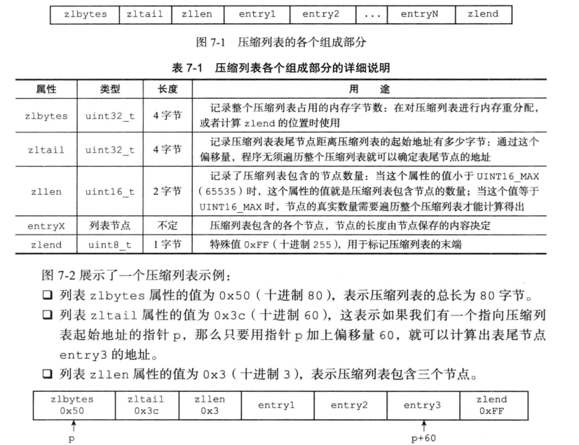
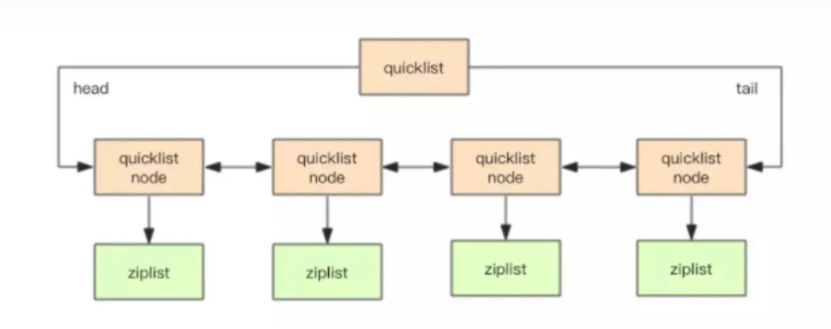

# 面试问题
1. redis快的原因
   1. 纯内存操作。
   2. 核心是基于非阻塞的 IO 多路复用机制。
   3. C 语言实现，一般来说，C 语言实现的程序“距离”操作系统更近，执行速度相对会更快。
   4. 单线程反而避免了多线程的频繁上下文切换问题，预防了多线程可能产生的竞争问题。
## 缓存带来的问题
1. 缓存与数据库不一致
   1. 串行化，读请求和写请求串行化，会大幅降低系统吞吐
   2. 旁路缓存：先更新数据库，删除缓存（因为缓存不一定是从数据库读到的数据，可能是从两个表中读出数据再进行运算）
   3. 旁路缓存的问题：更新数据库后，删除缓存失败，数据不一致
   4. 解决方案1：先删除缓存，再更新数据库（高并发情况下，可能会出现读取到更新数据库前的旧数据）
      1. 根据数据的唯一标识更新数据库，将同一个数据的操作放到同一个队列中。对于同一个数据的操作是串行的。读内存时没发现数据，就将读操作存到队列中（问题：数据更新频繁，大量操作积压在队列中）
   5. 解决方案2：延时双删，一段时间后再删除
   

2. 缓存并发竞争：多客户端同时写一个key
   1. mysql里的数据增加时间戳实现乐观锁，更新缓存时通过时间戳进行cas操作
   
   
3. 缓存雪崩、缓存穿透、缓存击穿
   1. 缓存雪崩：缓存宕机了，大量请求访问数据库
      1. 事前：Redis 高可用，主从+哨兵，Redis cluster，避免全盘崩溃。
      2. 事中：本地 ehcache 缓存 + hystrix 限流&降级，避免 MySQL 被打死。
      3. 事后：Redis 持久化，一旦重启，自动从磁盘上加载数据，快速恢复缓存数据。
   2. 缓存穿透：大量请求访问不在缓存中，直接访问数据库
      1. 布隆过滤器
         1. 请求数据的 key 不存在于布隆过滤器中，可以确定数据就一定不会存在于数据库中，系统可以立即返回不存在。
         2. 请求数据的 key 存在于布隆过滤器中，则继续再向缓存中查询
   3. 缓存击穿：热点key失效，大量请求击穿缓存
      1. 若缓存的数据是基本不会发生更新的，则可尝试将该热点数据设置为永不过期。
      2. 若缓存的数据更新不频繁，且缓存刷新的整个流程耗时较少的情况下，则可以采用基于 Redis、zookeeper 等分布式中间件的分布式互斥锁，或者本地互斥锁以保证仅少量的请求能请求数据库并重新构建缓存，其余线程则在锁释放后能访问到新缓存。
      3. 若缓存的数据更新频繁或者在缓存刷新的流程耗时较长的情况下，可以利用定时线程在缓存过期前主动地重新构建缓存或者延后缓存的过期时间，以保证所有的请求能一直访问到对应的缓存。

# 数据结构
键是字符串对象
值是字符串对象String、列表对象List、哈希对象Hash、集合对象Set、有序集合对象Zset
特殊数据类型：Geospatial（地理位置）、Hyperloglog（基数统计）、BitMaps（位图）
## 简单动态字符串SDS
1. 与c语言字符串相比：  
   1. 都以空字符结尾
   2. sds记录自身长度，c字符串不记录
2. sds的优势
   1. 获取长度不需遍历整个字符串（length）
   2. 在拼接时不会造成缓冲区溢出（length）
   3. 减少修改字符串带来的内存分配次数（free）
   4.  sds二进制安全，c字符串由于编码限制，不能保存图片、音频、视频压缩文件这样的二进制数据
   5.  可以使用部分'<string.h>'库中的函数
3. sds free字段的作用
   1. 实现空间预分配（优化字符串增长）和惰性空间释放（优化字符串减少），避免每次修改字符串都需要重新分配内存
```
struct sds{
    //记录字符的长度
    int len;
    //buf数组还能使用的字节数
    int free;
    //保存字符串，以'\0'结尾
    char buf[];
}
```
## 链表，无环双向
用于列表键、发布与订阅、慢查询、监视器等
```
typedef struct listNode{
    struct listNode* pre;
    struct listNode* next;
    void *val;//各种类型
}listNode;


typedef struct list{
    listNode *head;
    listNode* tail;
    //结点个数
    unsigned long len;
    //复制函数
    void dup(listNode* p);
    //释放函数
    void free(listNode* p);
    //对比函数
    int match(listNode* p,listNode* q);

}list;

```
## 字典
1. 字典组成
   1. 类型特定函数
   2. 私有数据
   3. 哈希表
   4. rehash索引，未进行rehash值为-1
2. 哈希表
   1. 哈希表数组
   2. 哈希表大小，size
   3. 哈希表大小掩码，用于计算索引，等于size-1
   4. 已使用的节点数量，used
3. 节点
   1. 键
   2. 值
```
//哈希表节点
typedef struct dictEntry{
    //键
    void *key;
    //值
    union{
        void *val;
        int val1;
        unsigned_int val2;
    }v;
    //哈希表节点，形成链表，指向下一个哈希值相同的键值对，解决哈希冲突
    struct dictEntry *next;
}dictEntry;

//哈希表

```
### 通过链地址法解决哈希冲突
### rehash，维持哈希因子在合理范围，对哈希表大小进行扩展和收缩

## 跳跃表
Zset的底层实现之一、集群节点
查找复杂度，平均lgN，最差N
1. 组成
   1. 节点
   2. zskiplist
2. 跳跃表节点： 
   1. level，层数
      1. 前进指针
      2. 跨度
   2. 后退指针：指向前一个节点
   3. 分值
   4. 成员对象，SDS
3. zskiplist
   1. 表头节点、表尾节点
   2. length，节点数量
   3. level，层数最大的节点的层数

## 整数集合intSet，有序、无重复
当只包含整数值元素，且数量不多时，redis采用整数集合作为set的底层实现。
```
typedef struct intset{
    //编码方式
    uint32_t encoding;
    //集合包含的元素数量
    uint32_t length;
    //保存元素的数组，虽然声明为int8，但实际类型根据encoding属性的值。encoding为INTSET_ENC_INT32，contents数组类型为int32。contents有序、无重复
    int8_t contents[];
}intset;
```
### 升级，intset不支持降级
当添加的新元素类型比集合现有元素的类型都要长时，需要对intset升级，这样才能添加新元素
1. 根据新元素的类型扩展intset空间大小，并分配空间
2. 将intset现有元素的类型都转换成新元素的类型
3. 添加新元素
提升灵活性（随意添加类型），节约内存（只在特殊情况进行升级）


## 压缩列表ziplist，节约内存
1. 列表键、哈希键的实现之一。当一个哈希键只包含少量列表项，并且每个列表项是小整数或短字符串，使用ziplist作为列表键的底层实现
  
2. ziplist节点
   1. previous_entry_length，前驱节点的长度。前驱节点长度小于254字节，当前节点用1字节保存这个值；不小于254字节，用5个字节
   2. encoding，保存内容的类型及长度，不同的编码区分整数和数组
   3. content，整数或字节数组
3. 连锁更新
   1. 每个节点记录了前驱节点的长度，当添加节点的长度超过254字节，可能会导致之后的所有节点previous_entry_length都需要扩展为5字节（原本为1字节）
   2. 删除节点也会导致同样情况


## 快速列表quicklist
1. 列表键的实现之一
   1. 连锁更新问题，ziplist更新效率低
   2. linkedlist存在大量内存碎片

```
typedef struct quicklistNode {
    struct quicklistNode *prev;
    struct quicklistNode *next;
    unsigned char *zl;
    unsigned int sz;             /* ziplist占用byte数*/
    unsigned int count : 16;     /* count of items in ziplist */
    unsigned int encoding : 2;   /* RAW==1 or LZF==2 */
    unsigned int container : 2;  /* NONE==1 or ZIPLIST==2 */
    unsigned int recompress : 1; /* was this node previous compressed? */
    unsigned int attempted_compress : 1; /* node can't compress; too small */
    unsigned int extra : 10; /* more bits to steal for future usage */
} quicklistNode;

typedef struct quicklistLZF {
    unsigned int sz; /* LZF size in bytes*/
    char compressed[];
} quicklistLZF;

typedef struct quicklist {
    quicklistNode *head;
    quicklistNode *tail;
    unsigned long count;        /* 所有ziplist中entry的数量 */
    unsigned long len;          /* quicklistNode的数量 */
    int fill : 16;              /* fill factor for individual nodes */
    unsigned int compress : 16; /* depth of end nodes not to compress;0=off */
} quicklist;

```

# 对象
1. 字符串，底层实现：整数值、embstr编码的SDS字符串、SDS
2. 列表，底层实现：ziplist、双端链表；quicklist
3. 哈希，底层实现：ziplist、字典
4. 集合，底层实现：intset、字典
5. 有序集合，底层实现：ziplist、跳跃表和字典
   
## 字符串对象，可以唯一被其它四个对象嵌套的对象
1. 存的是整数，并且可以用long表示，底层用int存储
2. 存的是浮点数，等同于存字符串
3. 存的是字符串，长度大于32字节，用SDS存储
4. 存的是字符串，长度小于等于32字节，用embstr编码的SDS存储
5. 当int、或embstr的对象改变时，会进行编码转换成SDS
6. set get append strlen...

## 列表对象
1. 3.2之前
   1. ziplist，所有字符串元素长度小于64字节，且元素数量小于512。
      1. 插入删除时需要申请和释放内存，同时会发生内存复制，更新效率低
   2. linkedlist，其它情况
      1. 每个节点保存前后指针、且都是独立的内存块，地址不连续，容易产生碎片
2. 3.2之后，quicklist
3. rpush lpush rpop lpop linsert len...


## 哈希对象
1. ziplist，将键和值作为两个节点放到表尾
2. hashtable
3. 编码转换：键值对小于512个，且键值对的长度都小于64字节用ziplist；否则用hashtable
4. hdel hset hget hlen...

## 集合对象
1. intset
2. hashtable
3. 编码转换，所有元素是整数，且数量不超过512，用intset；否则用hashtable
4. sadd spop sinter scard...


## 有序集合
1. ziplist，分别用两个节点存放成员和分值，这两个节点紧挨一起
2. skiplist（范围操作o(n)）+字典（查找操作o(1)），字典和跳跃表共享元素的成员和分值
3. 编码转换：数量小于128，长度小于64字节用ziplist，否则用skiplist
4. zadd zcard zrank zscore

## 基于类型多态命令
1. del expire rename type object...

## 内存回收
1. 构建对象的引用计数属性refcount，为0时内存释放
2. 对象生命周期：创建对象、操作对象、释放对象

## 对象共享
1. 引用计数属性也可用于共享，每次共享计数加1
2. 只共享整数，共享需要验证对象相等
   1. 验证整数字符串，o（1）
   2. 验证字符串，o（n）
   3. 验证多个值对象，o（n2）
3. redis初始化服务器时，会创建一万个字符串对象，0~9999，当需要用到这些对象时，服务器会共享这些对象，而不是创建新对象。redis只会对着一万个对象进行共享，这一万个对象的refcount 为INT_MAX，表示不被销毁的全局对象。同时，OBJ_SHARED_INTEGERS（10000）可以改变

## 对象空转
1.  redis对象包含属性：type（查看类型）、encoding（查看底层结构）、ptr、refcount（计数引用）、lru（最后一次访问时间）


# 单机数据库的实现
## 数据库
数据库由dict（保存键值对）和expires（保存过期时间）两个字典构成
1. 有16个数据库，0~15
   1. 添加键
   2. 删除
   3. 更新
   4. 取值
   5. dbsize exists rename keys
2. 设置键的生存时间或过期时间
   1. 命令
      1. expire，以秒为单位设置生存时间
      2. pexpire，以毫秒为单位设置生存时间
      3. expireat，设置过期的时间戳，到时间则过期，unix时间戳，long long 保存
      4. pexpireat，同上
      5. persist，移除过期时间
      6. ttl、pttl，查看键的剩余时间
   2. 过期判定过程
      1. 键是否存在于过期字典中；如果在，取得过期时间
      2. 根据当前unix时间戳判断是否大于过期时间
   3. 过期删除策略
      1. 定时删除，设置键的同时，创建定时器，时间一到立即删除。对内存友好，对cpu时间不友好（不现实）
      2. 惰性删除，只有在获取键的时候，查看键有没有过期，过期就删除。对cpu时间友好，对内存不友好
      3. 定期删除，上面的折中。每隔一段时间对数据库进行一次检查，删除过期键
   4.  redis采用惰性删除和定期删除的结合
       1.  惰性删除实现，读写数据库的命令，通过惰性删除检查键
       2.  定期删除实现，规定时间内，多次访问各个数据库，从数据库的过期字典中随机检查间检查一部分键的过期时间，并删除其中的过期键 
   5.  AOF、RDB和复制功能对过期键的处理
       1.  RDB文件
           1.  save、bgsave在生成RDB文件时，会检查数据库中的键，过期间不会被保存到RDB文件中
           2.  载入RDB文件时，
               1.  当前服务器以主服务器模式运行时，会对文件中保存的键进行检查，过期的则忽略
               2.  以从服务器模式运行时，无论有没有过期都会被载入
       2. AOF文件
          1. 文件写入，服务器持久化模式运行（AOF）时，键过期没有被删除，没有影响；删除了就向AOF文件追加一条del命令
          2. AOF重写，类似于RDB生成，对数据库的键进行检查，过期的不保存
       3. 复制
          1. 过期键的删除由主服务器控制
          2. 主服务器删除过期键时，会向所有从服务器追加del命令
          3. 从服务器只有在接受del命令，才会删除过期键
   6.  数据库通知
       1.  

## RDB持久化，快照
1. 数据库状态：数据库+键值对，存储在内存中，为了安全需要保存到磁盘中
2. RDB文件，二进制文件，保存数据库状态
### RDB创建和载入
1. 创建，
   1. save，阻塞进程，知道创建完毕
   2. bgsave，委派子进程创建文件
2. 载入，
   1. 服务器启动时自动执行（检测到RDB文件自动载入），阻塞进程
   2. 优先使用AOF文件还原数据，AOF更新频率更高

### 间隔性自动保存
1. 设置保存条件，用户未主动设置，服务器默认设置。保存在服务器状态redisSercer结构的savaparams结构（秒数，修改数）
2. dirty计数和lastsave属性（redisServer中）
   1. dirty计数器：记录距离上一次成功创建RDB文件进行了多少次修改
   2. lastsave：上一次成功创建RDB文件的unix时间

### RDB文件结构
1. RDB文件包含内容
   1. REDIS，常量。用以检查是否是RDB文件
   2. db_version，文件的版本号
   3. databases，数据库以及键值对数据
   4. EOF，常量。标志内容结束
   5. check_sum，校验和，用以检查纠错RDB文件
2. databases结构
   1. SELECTDB，标志后面是数据库
   2. db_number，数据库的编号
   3. key_value_pairs，键值对内容
      1. type，底层编码或对象类型
      2. key
      3. value

## AOF持久化，日志
1. 通过保存服务器执行的写命令记录数据库状态
### 功能实现
1. 命令追加
   1. 将写命令追加到缓冲区
2. 文件写入
   1. 将缓冲区的内容写到AOF文件
3. 文件同步
   1. 文件写入时，操作系统会先写入内存缓冲区，再将内存缓冲区的数据写入文件，会产生数据丢失问题
   2. 强制操作系统直接写入磁盘，不经过内存缓冲区

### AOF文件载入
1. 创建不带网络连接的伪客户端
2. 从AOF文件中分析并读取一条写命令
3. 使用伪客户端执行命令
4. 重复2-3操作

### AOF重写
1. AOF内容太多影响服务器或计算机性能。生成新的AOF文件替换旧文件
2. 原理：遍历旧AOF文件，将多条对同一键的写命令，合并成一条，从而创建新文件
3. 后台重写：创建新文件过程缓慢，阻塞线程。
   1. 通过子进程进行重写，不用线程因为会带来数据安全问题
   2. 两个进程并发进行，会造成数据库状态不一致：设置AOF重写缓冲区，redis执行一个写命令后，会同时写入AOF缓冲区和AOF重写缓冲区

## 事件
1. redis服务器事件驱动
   1. 时间事件，周期性事件和定时事件
   2. 文件事件，对套接字操作的抽象，套接字状态变为可应答、可写、可读就会产生文件事件
### 文件事件
Redis内部单线程
文件处理器以单线程方式运行，通过I/O多路复用监听多个套接字，将这些套接字放到队列中，有序同步执行

### 时间事件
无序链表实现，服务器遍历节点，节点到达某时刻就执行

## 客户端
服务端：客户端=1：N。服务器通过I/O多路复用实现文件事件处理。
1. 对于每个和服务器连接的客户端，服务器在本地为客户端建立一个client结构链表，保存客户端状态信息，使用clients（属性）链表连接起多个客户端状态
   1. 客户端状态的flags属性标志客户端的角色
   2. 客户端输入缓冲区记录客户端发送的命令
   3. 客户端输出缓冲区
   4. 。。。

## 服务端
用户《==》客户端《==》服务端
1. 用户发出请求；
2. 客户端接收到请求，客户端将请求转换成协议格式，通过套接字发给服务端；
   1. 命令
3. 服务端接收命令，操作数据库
   1. 客户端发送请求，套接字变得可读
   2. 服务端读取套接字中协议格式的命令，保存到clients的输入缓冲区
   3. 对缓冲区的命令进行分析，提取命令参数、个数等
   4. 执行命令
### 服务器初始化
1. 初始化服务器状态结构
   1. 设置服务器运行ID
   2. 设置默认运行频率
   3. 设置默认配置文件路径
   4. 设置运行架构
   5. 设置默认端口号
   6. 设置持久化条件
   7. 设置LRU时钟
   8.  创建命令表
2. 载入配置选项
3. 初始化数据结构
4. 还原数据库状态
5. 执行事件循环

# 多机数据库的实现
## 复制，读写分离
1. 主服务器，被复制的服务器，向主服务器写数据
2. 从服务器，从从服务器读数据

### 旧版复制功能
1. 同步，将从服务器的数据库状态更新至主服务器的数据库状态。（发送RDB文件）。耗资源的操作
2. 命令传播，同步期间，主服务器有了新的写命令，此时主服务器将命令发送给从服务器（发送命令）
3. 缺陷
   1. 初次复制。
   2. 断线后的重复制。效率低，重新创建发送RDB文件

### 新版复制功能
1. 完整重同步
2. 部分重同步：解决断线后重复制的低效问题。将
   1. 主服务器的复制偏移量、从服务器的复制偏移量。偏移量相等表示数据库状态一致
   2. 主服务器的复制积压缓冲区（定长队列，默认1MB）
      1. 主服务器传播命令时，同时写入从服务器和缓冲区，缓冲区为队列的字节记录相应的复制偏移量
   3. 服务器运行id
   4. 过程
      1. 断线重连，从服务器发送offset，如果offset之后的数据在缓冲区中，执行部分重同步（将命令发送给从服务器）；否则执行完整重同步
   5. 心跳机制
      1. master心跳：ping，判断slave是否在线
      2. slave心跳：REPLCONF ACK{offset}，汇报slave自己的复制偏移量,获取最新的数据变更指令。作用2:判断master是否在线

## Sentinel，哨兵，特殊模式下的redis服务器
redis高可用的解决方案：由一个或多个哨兵实例组成的系统监视任意多个主服务器及其从服务器。主服务器下线时，选择其从服务器作为新的主服务器。主服务器重新上线时，降级为从服务器。
1.  集群监控、消息通知、故障转移、配置中心
2. sentinel为每个主服务器创建相应实例，并创建连向主服务器的命令连接和订阅连接。命令连接用于发送命令请求，订阅连接用于接受hello频道信息
3. 哨兵会成为主服务器的客户端，并创建两个网络连接。
   1. 命令连接：向主服务器发送命令，接受命令
   2. 订阅连接：防止客户端不在线，丢失主服务器hello频道发送的信息
   3. 通过hello频道，哨兵系统和主从服务器发送接受命令（所有订阅频道的哨兵都能接受到同一个服务器命令）
4. 哨兵系统也会创建从服务器的两个连接
5. 哨兵系统向主从服务器发送信息
   1. 通过hello频道
6. 哨兵系统从主从服务器接受信息
   1. 通过hello频道
7. 哨兵A通过频道发现新的哨兵B时，会更新哨兵字典，创建和哨兵B的命令连接（哨兵之间不创建订阅连接）
8. 至少需要三个哨兵：保证健壮性
   1. quorum：确认下线的最少哨兵数量
   2. majority：同意故障转移的最少哨兵数量
   3. 如果只有两个哨兵，majority等于2，有一个哨兵下线，就没办法故障转移了。
### 主观下线、客观下线
1. 主观下线
   1. 通过命令连接发送消息，哨兵判断是否主观下线（服务器、其它哨兵）
   2. 每个哨兵对服务器主观下线的判断条件不同
2. 客观下线
   1. 判断：哨兵判断服务器主观下线，询问其它监视该服务器的哨兵，如果足够数量的哨兵判断其主观下线则认定为客观下线，进行故障转移
   2. 故障转移
      1. 选举领头哨兵：当主服务器客观下线时，需要进行故障转移（需要通过领头哨兵）。根据领头请求发送顺序，超过一半的哨兵承认则为局部领头
      2. 转移：在从服务器中选择优先级最高，复制偏移量最大，运行id最小的服务器作为主服务器，其余的作为从服务器，并复制主服务器状态。掉线的主服务器重新上线降级为从服务器
   
## 集群
1. 分布式数据库方案，通过分片数据共享，提供复制和故障转移
2. 节点只能使用0号数据库
3. 通过握手将其它节点添加到自己的集群中

### 槽指派
1. redis通过分片的方式保存数据库的键值对，集群的整个数据库被分为16384个槽，每个键都属于其中的一个槽。每个节点最多可以处理16384个槽。
2. 所有槽都有节点处理则处于上线状态，否则处于下线状态
3. 集群处于上线状态，客户端可以向集群发送指令
4. 集群节点通过消息进行交流
   
### 集群中执行命令
1. 计算键属于哪个槽：```i=CRC-6(key)&16383```
2. 判断槽是否由当前节点处理，```判断clusterState.slots[i]、clusterState.myself是否相等，不等则会根据clusterState.slots[i]指向的结构记录的节点ip和端口号返回```
3. moved 错误：节点发现所在的槽不由自己处理，向客户端返回moved 错误（含有正确节点的ip和端口）
4. 重新分片，新建或删除redis实例时，将槽的键值对从一个节点移到另一个节点中
5. ASK错误，键值对从A迁移到B时，A没能在自己的数据库中找到键值对，向客户端返回ASK错误，指引客户端去B查找键值对
6. 区别
   1. moved错误，将槽的负责权由一个节点转向另外一个节点
   2. ASK错误，两个节点在迁移槽过程使用的临时措施
7. 脑裂：网络问题导致哨兵认为主服务器下线，从而选了另一个主服务器。而客户端一直在向原主服务器写数据
   1. min-slaves-to-write 3，连接到master的最少slave数量
   2. min-slaves-max-lag 10，slave连接到master的最大延迟时间
8. 哈希槽有16384：2kb大小，redis实例之间的通信不会有太大的开销，也能让redis实例分配到的槽比较均匀

### 复制与故障转移
1. 设置主从节点，从节点复制
2. 故障检查，节点定期ping消息。在线状态、疑似下线状态、下线状态（半数以上认为疑似下线）
3. 故障转移
4. 复制

# 独立功能的实现

## 发布与订阅
1. 客户端订阅频道，其它客户端向频道发送消息时，所有订阅的客户端都能收到消息
### 频道订阅与退订
1. 频道订阅关系保存在字典中
2. 订阅subscribe，退订unsubscribe
### 模式订阅与退订
1. 模式订阅关系保存在链表中
2. 订阅模式，pubsubpattern结构保存模式
   1. 订阅：```psubscribe 'news.*'```
   2. 退订：```punsubscribe 'news.*'```

## 事务
1. multi、exec、watch
### 事务的实现
1. 事务开始，multi
2. 命令入队，**只入队正确的命令**
3. 事务执行，exec
### watch，乐观锁
1. 在执行exec命令时，检查被watch的键是否被修改过，修改过就拒绝执行
2. watch的键被修改过，客户端redis_dirty_cas标识打开
### 细节
1. AOF模式下，appendfysnc=always时，redis具有事务持久性。（异步执行BGSAVE不能保证第一时间被保存到硬盘）

# redis相关指令
1. 查看底层结构，object encoding name
2. 查看对象类型，type name
3. 订阅和退订
   1. 订阅频道：```subscribe 'news.it'```
   2. 退订频道：```unsubscribe 'news.it'```
   3. 订阅模式：```psubscribe 'news.*'```
   4. 退订模式：```punsubscribe 'news.*'```
   5. 查阅订阅频道：```pubsub channels```


# 缓存策略
1. 旁路缓存
   1. 写：先更新DB，再删除cache（写速度慢于读，数据不一致概率小一点）
   2. 读：先读cache，读不到读DB，从DB读到写入cache
   3. 缺陷1：首次请求数据一定不在cache中
      1. 将热点数据提前放入cache中
   4. 缺陷2：写操作比较频繁的话导致cache中的数据会被频繁被删除，这样会影响缓存命中率 。
      1. 更新DB的时候，也更新cache
2. 读写穿透
   1. 写
      1. 先查 cache，cache 中不存在，直接更新 DB。
      2. cache 中存在，则先更新 cache，然后 cache 自己更新 DB（同步更新 cache 和 DB）
   2. 读
      1. 从 cache 中读取数据，读取到就直接返回
      2. 读取不到的话，先从 DB 加载，写入到 cache 后返回响应。
      3. 缺陷1：首次请求数据一定不在cache中
         1. 将热点数据提前放入cache中
3. 异步缓存，类似于读写穿透，但是异步更新DB
4. 根据cap理论，缓存只适合弱一致性场景
   1. 延时双删保证最终一致性
   2. 重试机制，第二次删除失败，就将删除失败的key放到消息队列中
   3. 读取binlog异步删除缓存，重试机制会导致业务代码侵入
5. 数据一致性分为强一致性、弱一致性、最终一致性。
   1. 时刻保证客户端看到的数据都是一致的，那么称之为强一致性。
   2. 如果允许存在中间状态，只要求经过一段时间后，数据最终是一致的，则称之为最终一致性。
   3. 此外，如果允许存在部分数据不一致，那么就称之为弱一致性。
6. 问题
   1. 缓存穿透：查询不存在的数据
      1. 缓存空对象
      2. 布隆过滤器
   2. 缓存击穿：热点数据过期瞬间，大量请求过滤
      1. 加互斥锁
      2. 不过期
   3. 缓存雪崩：redis大批量数据不可以（redis宕机、大量数据过期）
      1. 避免同时过期
      2. 构建高可用redis
      3. 多级缓存
      4. 限流、降级
7. 分布式锁
   1. 同步锁：在多个线程都能访问到的地方，标记权限
   2. 分布式锁：在多个进程都能访问到的地方，标记权限
   3. 实现方法
      1. 基于数据库
      2. 基于redis
         1. 原则：独享、无死锁、容错
         2. 使用命令获取锁
         3. 使用lua脚本释放锁
      3. 基于zookeeper
   4. 多redis实例实现分布式锁，redlock算法，java版本redisson
      1. 获取当前unix时间
      2. 依次尝试从N个实例，使用相同的key和随机值获取锁，并设置超时时间。
      3. 客户端使用当前时间-开始获取锁的时间，得到获取锁使用的时间。当且仅当大多数的redis节点都取到锁，并且使用时间小于锁失效时间，锁才算取得成功
      4. 取到了锁，key的真正有效时间等于有效时间-获取锁使用的时间
      5. 获取锁失败，客户端应该在所有redis实例上解锁