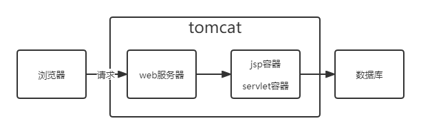
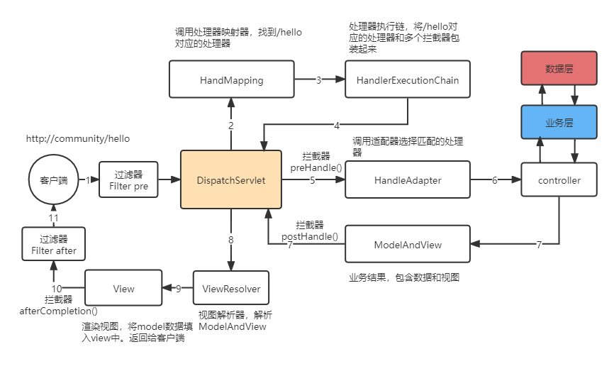

spring MVC位于视图层
- M：model，模型层
- V：view，视图层
- C：controller，控制层

## servlet
1. web组件，运行在服务器端，由servlet容器管理

## tomcat
1. servlet容器、jsp容器、web服务器

## 请求过程

### HandlerExecutionChain
1. 即处理执行链。将处理器进行包装，它包含了
- 一个处理器，即 HandlerMethod
- 多个拦截器，即 HandlerInterceptor
  
### Filter过滤器
1. 处于tomcat内部，web服务器之后（web服务器执行doFilter），servlet之前
### intercepter拦截器
1. 在controller之前，有三个方法
- preHander
- postHander
- afterCompletion
2. 调用多个拦截器顺序  
A.pre -> B.pre -> C.pre -> D.pre->  
D.post -> C.post -> B.post -> A.post->  
D.after -> C.after -> B.after -> A.after

### 区别
- 过滤器基于函数回调；依赖于servlet容器；只在初始化调用一次；对所有请求有效
- 拦截器基于java反射；不依赖servlet容器；可被多次调用；只对action请求有效，可以访问action上下文

### 重定向(redirect)和转发(forward)
- forward（转发）：  
是服务器请求资源,服务器直接访问目标地址的URL,把那个URL的响应内容读取过来,然后把这些内容再发给浏览器.浏览器根本不知道服务器发送的内容从哪里来的,因为这个跳转过程实在服务器实现的，并不是在客户端实现的所以客户端并不知道这个跳转动作，所以它的地址栏还是原来的地址.
- redirect（重定向）：  
是服务端根据逻辑,发送一个状态码,告诉浏览器重新去请求那个地址.所以地址栏显示的是新的URL.  
转发是服务器行为，重定向是客户端行为。
1. 从地址栏显示来说  
forward是服务器请求资源,服务器直接访问目标地址的URL,把那个URL的响应内容读取过来,然后把这些内容再发给浏览器.浏览器根本不知道服务器发送的内容从哪里来的,所以它的地址栏还是原来的地址.
2. redirect是服务端根据逻辑,发送一个状态码,告诉浏览器重新去请求那个地址.所以地址栏显示的是新的URL.
3. 从数据共享来说  
forward:原始页面和转发页面可以共享request里面的数据.  
redirect:不能共享数据.
4. 从运用地方来说  
forward:一般用于用户登陆的时候,根据角色转发到相应的模块.  
redirect:一般用于用户注销登陆时返回主页面和跳转到其它的网站等
5. 从效率来说  
forward:高  
redirect:低