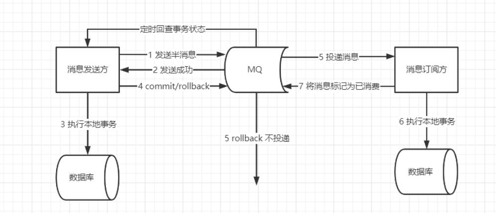

## 分布式
分布式是面向服务的，将一个服务分成多个子服务，这些子服务通常在不同的服务器上

## 分布式事务
1. 定义
2. CAP定理
   1. C：一致性，多个副本之间能否保持一致的特性
      1. 强一致性：时刻保证客户端看到的数据都是一致的
      2. 弱一致性：允许存在部分数据不一致
      3. 最终一致性：允许存在中间状态，只要求经过一段时间后，数据最终是一致的
   2. A：可用性，服务必须一直处于可用的状态
   3. P：分区容错性
3. CAP应用
   1. 放弃P：放弃可扩展性，放弃分布式
   2. 放弃A：放弃可用性
   3. 放弃C：放弃一致性
4. BASE定理：对分布式AP的延伸，牺牲强一致性保证基本可用性
   1. 基本可用
   2. 软状态，允许系统中的数据存在中间状态
   3. 最终一致性
5. 分布式事务分类
   1. 刚性事务，满足CP理论，满足强一致性
      1. 2PC两阶段提交
         1. 提交事务请求
         2. 执行事务提交
      2. 3PC，
         1. CanCommit
         2. PreCommit
         3. doCommit
      3. 2PC、3PC区别
         1. 3PC主要解决的单点故障问题，并减少阻塞
         2. 3PC有效降低了2PC带来的参与者阻塞范围，并且能够在出现单点故障后继续达成一致；在参与者收到preCommit消息后，如果网络出现分区，协调者和参与者无法进行后续的通信，这种情况下，参与者在等待超时后，依旧会执行事务提交，这样会导致数据的不一致。
         3. 三阶段提交协议在协调者和参与者中都引入 超时机制
   2. 柔性事务，满足BASE理论
      1. 补偿型事务，同步，TCC、Sage
      2. 通知型事务，异步，异步确保型事务（用于内部系统）、最大努力通知（用于外部系统）
   3. 通知型解决方案：异步确保型事务，MQ解决
      1. 
   4. 补偿性解决方案：seata
      1. TC：事务协调者、TM：事务发起者、RM：资源管理者
      2. seata AT，自动化分支事务
         1. 使用前提：基于支持本地事务的关系型数据库
         2. 流程
            1. 一阶段：业务数据和回滚日志记录在同一个本地事务中提交，释放本地锁和连接资源
            2. 二阶段：提交异步化，非常快速地完成；或回滚通过一阶段的回滚日志进行反向补偿
      3. seata TCC
         1. 流程
            1. 一阶段：prepare：预留资源
            2. 二阶段：commit或rollback：提交或释放资源
         2. TCC 对业务代码侵入严重：每个阶段的数据操作都要自己进行编码来实现，事务框架无法自动处理。
         3. TCC 性能更高：不必对数据加全局锁，允许多个事务同时操作数据
6. 分布式事务问题解决方案
   1. XA（2pc、3pc），应用在数据库层面
      1. 同步阻塞，当协调者发送 prepare 请求，参与者收到之后如果能处理那么它将会进行事务的处理但并不提交，这个时候会一直占用着资源不释放，如果此时协调者挂了，那么这些资源都不会再释放了，这会极大影响性能。
      2. 单点故障，如果协调者挂了那么整个系统都处于不可用的状态了。
      3. 数据不一致（阶段二只发送了部分 commit 消息，此时网络发生异常，那么只有部分参与者接收到 commit 消息）
      4. 不确定性
   2. TCC（try，confirm，cnacel），应用层面的2pc
      1. 解决了协调者单点，由主业务方发起并完成这个业务活动。业务活动管理器也变成多点，引入集群。
      2. 解决了同步阻塞：引入超时，超时后进行补偿，并且不会锁定整个资源，将资源转换为业务逻辑形式，粒度变小。
      3. 解决了数据一致性，有了补偿机制之后，由业务活动管理器控制一致性
   3. SAGA方案
   4. 本地消息表，依赖于数据库的消息表来管理事务
   5. 可靠消息最终一致性方案
   6. 最大努力通知方案
7. 
   1. 强一致性：Seata AT
   2. 弱一致性：Seata TCC
   3.  最终一致性：异步确保型

# 分布式协议
## raft

## 网关

## 分布式id
UUID
雪花算法：64位

## rpc

## 分布式协调服务-zookeeper
1. 特点
   1. 顺序一致性
   2. 原子性
   3. 单一系统映像
   4. 可靠性
2. 应用场景
   1. 分布式锁，通过创建唯一节点获得分布式锁，当获得锁的一方执行完相关代码或者是挂掉之后就释放锁。
   2. 命名服务，可以通过 ZooKeeper 的顺序节点生成全局唯一 ID
   3. 数据发布订阅，Watcher 机制 
3. 基本概念
   1. 数据模型

# 分布式服务dubbo
## rpc，远程程序调用
## dubbo
1. dubbo提供的功能
   1. 负载均衡 ： 同一个服务部署在不同的机器时该调用哪一台机器上的服务。
   2. 服务调用链路生成 ： 随着系统的发展，服务越来越多，服务间依赖关系变得错踪复杂，甚至分不清哪个应用要在哪个应用之前启动，架构师都不能完整的描述应用的架构关系。Dubbo 可以为我们解决服务之间互相是如何调用的。
   3. 服务访问压力以及时长统计、资源调度和治理 ：基于访问压力实时管理集群容量，提高集群利用率。

## 分布式任务调度
1. Quartz
   1. 多节点部署，通过竞争数据库锁来保证只有一个节点执行任务

