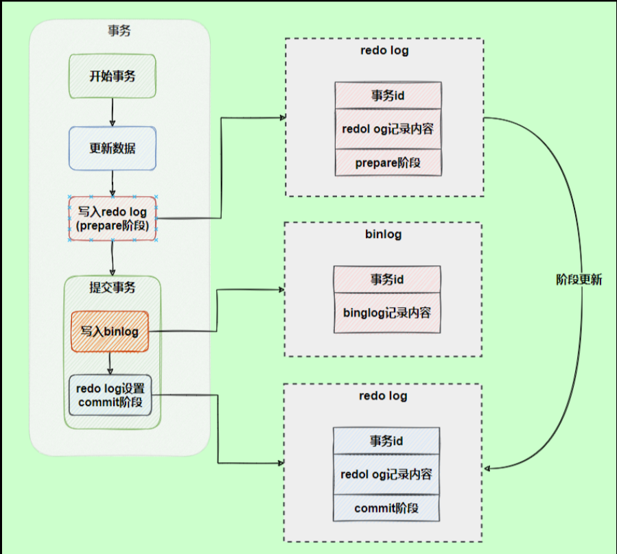

# 数据库基础知识
### 范式
1. 第一范式：属性不能再分割
2. 第二范式：消除了非主属性对于码的部分函数依赖
3. 第三范式：消除了非主属性对于码的传递函数依赖
4. BC范式：


# 数据库基础知识

## ACID特性
1. A，原子性，事务的操作要么全做要么全不做。undo log
2. C，一致性，事务执行前后，数据库状态保持一致
3. I，隔离性，事务不被其它事务干扰。锁机制、MVCC
4. D，持久性，事务提交后，不会改变，故障也不受影响。redo log

## 查询处理过程
1. 客户端通过连接器进行管理链接和权限认证
2. 查缓存，查到则返回
3. 查数据库，通过分析器
   1. 词法分析
   2. 语法分析
   3. 生成语法树
4. 生成初始逻辑查询计划，通过优化器
   1. 查询重写，生成最优逻辑查询计划
5. 生成物理查询计划，
   1. 物理查询计划评价，生成最佳物理查询计划
6. 执行查询计划
# Mysql
## mysql数据库引擎
1. innoDB，支持行级锁（MVCC是行级锁的升级）、事务、外键、安全恢复
   1. 使用redo log保证事务持久性、undo log保证事务原子性
   2. 默认支持的事务隔离性（可重复读）
2. MyISAM
3. 
## 索引
### 底层结构
1. 数组和链表，不适合大数据量
2. 哈希，o(1)，快，但是不支持顺序查找和范围查询
3. 
4. B树，多路平衡查找树。
   1. 节点存放键、数据
5. B+树
6. 为什么需要一个自增id作为主键
   1. 避免在插入数据的时候，频繁旋转、合并操作，提高效率，减少空间碎片

### 逻辑分类
1. 主键primary（索引）是唯一索引的特例，值唯一，不允许有空值
2. 二级索引（辅助索引）
   1. 唯一索引（unique），值唯一，允许空值
   2. 普通索引（index）
   3. 联合索引（前缀索引）
   4. 全文索引（fulltext）
3. 通过explain + sql语句，查看type类型，知道sql语句有没有走索引。all表示走全表

### 物理分类
1. 聚集索引：索引结构和数据存放在一起。主键索引
   1. 查询块
   2. 依赖于有序的数据、更新代价大
2. 非聚集索引：分开存放。二级索引属于非聚集索引
   1. 更新代价较小
   2. 可能会二次查询

### 不走索引的情况
1. 在列上运算或函数
```
-- 全表扫描
select * from article where year(publish_time) < 2019
-- 走索引
select * from article where publish_time < '2019-01-01'
-- 全表扫描
select * from article where id + 1 = 5
-- 走索引
select * from article where id = 4
```
2. 隐式类型转换
```
假设id为varchar类型
-- 全表扫描
select * from article where id = 100
-- 走索引
select * from article where id = '100'
```
3. 前导模糊查询不会使用索引
```
-- 全表扫描
select * from article where author like '%李'
//但是'李%'走索引
```
4. 联合索引最左前缀原则
   1. mysql会一直向右匹配直到遇到范围查询(>、<、between、like)就停止匹配，比如a = 1 and b = 2 and c > 3 and d = 4 如果建立(a,b,c,d)顺序的索引，d是用不到索引的，如果建立(a,b,d,c)的索引则都可以用到，a,b,d的顺序可以任意调整
   2. 联合索引（a,b,c,d) 查询a，d时，不会走d。默认a，ab，abc，adcd
5. 负向条件索引不会使用索引，建议用in
   1. 负向条件有：!=、<>、not in、not exists、not like 等

### 特殊
1. 回表，二次查询，当查到索引对应的指针或主键后，可能还需要根据指针或主键再到数据文件或表中查询。非聚集索引（节点存放指针）的缺点。
2. 覆盖索引，索引包含了所有查询的字段，不需要回表

## mvcc 多版本控制
1. 参考（https://blog.csdn.net/Waves___/article/details/105295060#1.2%E3%80%81Read%20View%20%E7%BB%93%E6%9E%84）
2. 提高读写并发性能，在读（快照读）写操作时不用加锁，适合读已提交和可重复读的隔离级别。此时只有写写事务才会阻塞
   1. 快照读，读取的数据可能来自之前版本的数据库
   2. 当前读，读取最新版本的数据库记录，需要加锁
3. 原理
   1. 每行数据的隐藏字段：DB_TRX_ID，记录最近一次修改本行的事务ID；DB_ROLL_PTR，回滚指针；DB_ROW_ID，表没有主键或唯一非空键时，自动产生的自增id。
   2. undo日志版本链，记录了新老版本的数据，当一个事务读取记录行时，当前记录找不到，顺着版本链找满足可见性条件的记录行版本。
      1. 事务过程修改记录时，在版本链上添加记录，并将隐藏字段的回滚指针指向上一个版本
   3. read view，用以可见性判断，保存了本事务不可见的其它活跃事务。事务开启后，执行的sql会生成视图，这个视图由所有提交快照的活跃事务id列表，事务表中最早的事务up_limit_id，read view中出现过最大事务id+1（下一个将被分配的事务）low_limit_id组成
      1. 可见性判断
      2. DB_TRX_ID < up_limit_id，符合可见性判断(up_limit_id事务知道DB_TRX_ID当前事务的存在)
      3. DB_TRX_ID >= low_limit_id，回滚上一个版本查找
      4. 否则在获取事务表中查找，因为有序，二分查找，在表中表示不可见

## 日志
1. redo 日志，持久性
   1. 有更新前的值，恢复未完成的事务，先写数据在再写日志（先将数据写到磁盘，再将日志写到磁盘），内存代价小，恢复代价高
2. undo 日志，原子性
   1. 实现mvcc，事务回滚
   2. insert、update（delete也是update）
   3. 有更新后的值，重复已提交的事务，先写日志再写数据，内存代价大，恢复代价小
3. bin 日志
   1. 服务器产生的日志，用以数据恢复或数据库复制
4. 日志恢复redo log和binlog一致性问题
   1. 两阶段提交，将redo log 分为perpare和commit两步
   2. 

## 并发事务带来的问题
1. 脏读，读取未提交数据。（回滚操作）
2. 丢失修改，（提交、回滚）
   1. 第一类丢失更新：一个事务1的回滚导致事务2更新的数据丢失（事务回滚）
   2. 第二类丢失更新：一个事务1的提交导致事务2更新的数据丢失（事务提交）
3. 不可重复读，两次读的数据不同（修改）（提交）
4. 幻读，两次读取的数据数量不同（添加删除）（提交）
   1. 快照读，可重复读隔离级别可以防止幻读，事务不可见
   2. 当前读，通过MVCC+next key lock防止幻读


## 事务隔离级别
1. 读取未提交，存在所有问题
2. 读取已提交。解决回滚操作带来的问题。存在第二类丢失更新、不可重复读、幻读。
   1. 每次select 查询前都生成一个Read View (m_ids 列表)
3. 可重复读，存在幻读问题
   1. 只在事务开始后第一次select 数据前生成一个Read View（m_ids 列表）
4. 可串行化，无问题
5. 读取已提交和可重复读的实现区别在于read view生成策略不同

## 三种行级锁
1. Record Lock：单个行记录上的锁。
2. Gap Lock：间隙锁，锁定一个范围，但不包括记录本身。GAP锁的目的，是为了防止同一事务的两次当前读，出现幻读的情况。只存在于可重复读或以上隔离级别。
3. Next-Key Lock：1+2，锁定一个范围，并且锁定记录本身。对于行的查询，都是采用该方法，主要目的是解决幻读的问题。索引记录上的记录锁和索引记录之前的间隙上的间隙锁的组合。
