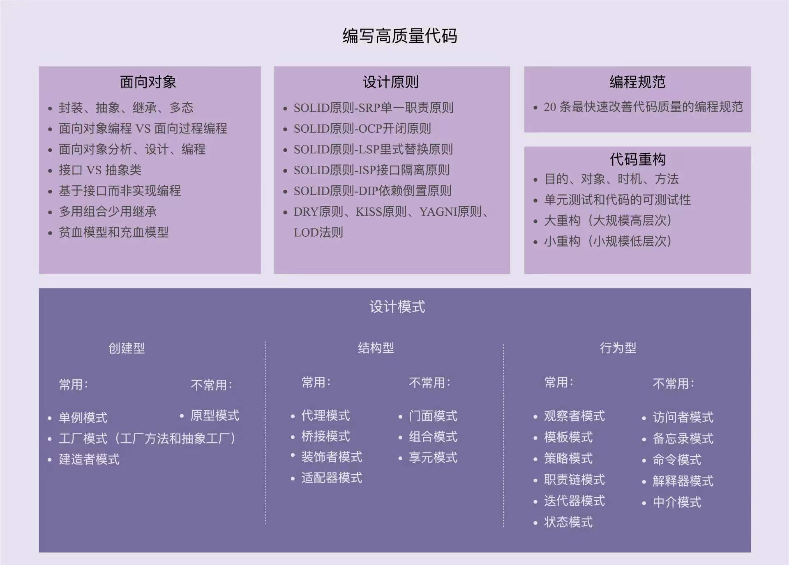

# 设计模式
[链接](https://www.zhihu.com/question/308850392 "leetcode知乎主页")   



## 六大原则
### 单一原则（SRP）
1. 一个类仅有一个引起它变化的原因
### 开放封闭原则（OCP）
1. 对扩张开放，对修改关闭
2. 在程序需要进行拓展的时候，不能去修改原有的代码，实现一个热插拔的效果。通过接口和抽象类实现。
3. 对于频繁变化的部分抽象化
### 里氏代换原则（LSP）
1. 基类出现的地方，子类也可以出现，子类型可以替换其父类型
2. 基类复用的基石
3. 实现开闭原则的关键步骤就是抽象化，而基类与子类的继承关系就是抽象化的具体实现，所以里氏代换原则是对实现抽象化的具体步骤的规范。
### 依赖倒装原则（DIP）
1. 面向接口编程，依赖于抽象，而不依赖于具体细节
### 接口隔离原则（ISP）
1. 使用多个隔离的接口，而不是一个接口
2. 降低耦合
### 迪米特原则，最少知道原则（DP）
1. 一个实体尽量少地与其它实体发生作用，使模块更独立
### 另外一种原则——合成/聚合原则
1. 尽量使用聚合方式，而不是继承
## 23种模式

### 5种创建型模式

#### 1、工厂模式
1. **简单工厂**
- 工厂承担构建所有对象的职责，调用者只需简单调用
- 违背了单一原则：一个工厂负责多个产品
- 违背了开闭原则：修改产品时，需要修改工厂
2. **工厂方法**
- 解决简单工厂的两个问题，每个产品有一个专门的工厂调用者调用专门的工厂即可
- 调用者更换工厂麻烦
#### 2、抽象工厂
1. 对工厂方法的进一步优化，提取各个工厂接口
2. 调用者替换工厂简单
3. 适合新增同类工厂，不适合新增功能
#### 工厂总结
**简单工厂**：工厂方法的特例，用来生成同一等级结构种的任意产品（不支持扩展增加产品）  
**工厂方法**：解决了工厂方法的两个问题，用来生成同一等级结构种的固定产品（支持扩展增加产品）  
**抽象工厂**：对工厂方法的优化，用来生产不同产品族的全部产品。（不支持拓展增加产品；支持增加产品）
#### 3、单例模式
1. 避免对对象重复创建，节约空间提升效率
2. 创建方法
- 饿汉式，类加载时，声明并实例化。private修饰构造函数保证其它类无法实例化此类；无论是否需要都会被实例化
```
public class Singleton{

    private static Singleton instance = new Singleton();

    private Singleton(){
    }

    public static Singleton getInstance(){
        return instance;
    }
}
```
- 懒汉式，类加载时，只声明不实例化。线程不安全（同时间多个线程调用，instance会被实例化多次）
```
public class Singleton{

    private static Singleton instance = null;

    private Singleton(){
    }

    public static Singleton getInstance(){
        if(instance == null){
            instance = new Singleton();
        }
        return instance;
    }
}
```  
- 双重检测，加锁。当多个线程调用instance时，每次都需要执行sunchronized同步化方法，影响效率，所以加两重锁。JVM的指令重排可能会导致线程不安全，需要给instance变量加 volatile关键字。
```
public class Singleton{

    private static volatile Singleton instance = null;

    private Singleton(){
    }

    public static Singleton getInstance(){
        if(instance == null){
            synchronized(Singleton.class){
                if(instance == null){
                    instance = new Singleton();
                }
            }
        }
        return instance;
    }
}
``` 
- 静态内部类  

Java 类的加载过程包括：加载、验证、准备、解析、初始化。初始化阶段即执行类的 clinit 方法（clinit = class + initialize），包括为类的静态变量赋初始值和执行静态代码块中的内容。但不会立即加载内部类，内部类会在使用时才加载。所以当此 Singleton 类加载，SingletonHolder 并不会被立即加载，所以不会像饿汉式那样占用内存。
- Java 虚拟机规定，当访问一个类的静态字段时，如果该类尚未初始化，则立即初始化此类。当调用Singleton 的 getInstance 方法时，由于其使用了 SingletonHolder 的静态变量 instance，所以这时才会去初始化 SingletonHolder，在 SingletonHolder 中 new 出 Singleton 对象。这就实现了懒加载。
- 虚拟机在加载类的 clinit 方法时，会保证 clinit 在多线程中被正确的加锁、同步。即使有多个线程同时去初始化一个类，一次也只有一个线程可以执行 clinit 方法，其他线程都需要阻塞等待，从而保证了线程安全。
```
public class Singleton{

    private Singleton(){
    }

    public static Singleton getInstance(){
        return LazyHolder.instance;
    }

    private static class LazyHolder{
        private static final Singleton instance = new Singleton();
    }
}
```
- 枚举类，加锁。当多个线程调用instance时，每次都需要执行sunchronized同步化方法，影响效率，所以加两重锁。JVM的指令重排可能会导致线程不安全，需要给instance变量加 volatile关键字。
```
public enum Singleton{
    INSTANCE;
    //自定义方法
    public void operation(){
    }
}
```
#### 4、建造者模式
1. 用于构建创建过程稳定，但配置多变的对象
2. 构建静态内部类Builder，Builder与外部类有相同的属性，通过调用Builder的构造函数构建外部类
#### 5、原型模式
1. 用原型实例指定创建对象的种类，并通过拷贝这些原型创建新的对象
2. Java中，Object的clone()方法属于原型模式，只深拷贝基本数据类型，对于非基本数据类型需要修改接口，对Tea实现Cloneable接口
```
public class Tea implements Cloneable{
    public boolean ice;
    public String size;
    @NonNull
    @Override
    protected Tea clone() throws CloneNotSupportedException{
        return (Tea) super.clone();
    }
}
private void order(){
    Tea a = new Tea();
    a.ice=false;
    a.size=big;
    //无效，a、b指向同一个对象
    Tea b = a;
    //有效，深拷贝，此处的clone经过修改，可以深拷贝Tea
    Tea c = a.clone();
}
```
### 7种结构型模式
#### 1、适配器模式，包装
1. 适用于有相关性但不兼容的结构，通过转换使相关部分连接
2. 改变接口，不改变功能
#### 2、桥接模式
1. 将抽象部分（颜色和形状）与实现部分（圆形、方形；白色、黑色）分离，使他们独立变化
2. 在形状子类（方形）中，桥接颜色对象（白色）
#### 3、组合模式
1. 当整体与部分有相似的结构，可以使用组合模式。例如：文件夹与子文件夹、总公司与子公司
2. 透明模式（大部分情况）：子结构不需要的方法也被整合到接口中，违反了接口隔离原则；子结构可以访问非自生方法，不安全
3. 安全模式：只整合子结构需要的方法到接口中，不够透明，无法区别对待
#### 4、装饰模式，包装
1. 动态地给对象增加一些额外的职责
2. 增强类原有的功能，为类增加一个新的功能，不改变原有的类  
3. 做法：实现一个接口包装对象，再对这个接口增强功能或添加方法
- 增强功能,透明模式
```
// 多次装饰 
IBeauty meWithManyDecorators = new NecklaceDecorator(new RingDecorator(new EarringDecorator(me)));
System.out.println("戴上耳环、戒指、项链后，我的颜值：" + meWithManyDecorators.getBeautyValue()); ​ 
// 任意搭配装饰 
IBeauty meWithNecklaceAndRing = new NecklaceDecorator(new RingDecorator(me)); 
System.out.println("戴上戒指、项链后，我的颜值：" + meWithNecklaceAndRing.getBeautyValue()); 
```
- 添加功能，半透明模式，无法多次修饰（新增功能的类装饰之后，其它装饰类无法访问该功能）
- 增强功能，添加功能，全不透明模式  

#### 5、外观模式
1. 体现封装思想，外部与子系统的通信必须通过一个统一的外观对象
2. MVC架构中，controller看作是外观类
#### 6、享元模式
1. 体现了程序可复用，共享对象
#### 7、代理模式
1. 给某一个对象提供一个代理，并由代理对象控制对原对象的引用
2. 类似于装饰模式，但代理模式主要是为了加以控制,权限管理
3. 静态代理，同装饰模式相同
```
public interface IHttp {···}

public class HttpUtil implements IHttp {···}

public class HttpProxy implements IHttp { 

    private final HttpUtil httpUtil; ​ 

    public HttpProxy(HttpUtil httpUtil) { 
        this.httpUtil = httpUtil; 
    } ​ 

    @Override 
    public void request(String sendData) {···} ​ 

    @Override 
    public void onSuccess(String receivedData) {···} 
}

public void test() { 

    HttpUtil httpUtil = new HttpUtil(); 

    HttpProxy proxy = new HttpProxy(httpUtil); 

    proxy.request("request data"); 

    proxy.onSuccess("received result"); 
}
```
4. 动态代理，传入一个类，然后根据正在调用的方法名（反射技术）判断是否加以控制。效果一样，代码量较少
```
public class HttpProxy implements InvocationHandler { 

    private HttpUtil httpUtil; ​ 

    public IHttp getInstance(HttpUtil httpUtil) { 
        this.httpUtil = httpUtil; 
        return (IHttp) Proxy.newProxyInstance(httpUtil.getClass().getClassLoader(), httpUtil.getClass().getInterfaces(), this); 
    } ​ 

    // 调用 httpUtil 的任意方法时，都要通过这个方法调用 
    @Override public Object invoke(Object proxy, Method method, Object[] args) throws Throwable { 
        Object result = null; 
        if (method.getName().equals("request")) { 
            // 如果方法名是 request，打印日志，并调用 request 方法 
            result = method.invoke(httpUtil, args); 
        } else if (method.getName().equals("onSuccess")) { 
            // 如果方法名是 onSuccess，打印日志，并调用 onSuccess 方法 
            result = method.invoke(httpUtil, args); 
        } 
        return result; 
    } 
}

public void test() { 

    HttpUtil httpUtil = new HttpUtil(); 

    HttpProxy proxy = new HttpProxy().getInstance(httpUtil); 

    proxy.request("request data"); 

    proxy.onSuccess("received result"); 
}
```

### 11种行为型模式
#### 1、观察者模式
1. 定义对象间的一对多依赖关系，当一个对象的状态发生改变时，依赖于它的对象得到通知并自动更新
2. 一个对象发生一个事件后，逐一通知监听这个对象的监听者，监听者对事件做出响应

#### 2、状态模式
1. 当一个对象的内在状态改变时允许改变其行为，就像改变了类
2. 关于多态的设计模式
3. 普通用户、会员，状态不同，行为不同

#### 3、策略模式
1. 定义了一系列算法，并将这些算法封装起来，使他们可以相互替换
2. 类似于状态模式，一个变量控制

#### 4、模板方法模式
1. 定义一个操作中的算法骨架（调用方法以及它们的顺序），将特定方法延迟到子类中。模板方法使得子类可以不改变一个算法的结构即可重定义该算法的某些特定步骤
2. 关于继承的设计模式
- 如果不希望子类覆写模板中的某个方法，使用 final 修饰此方法； 
- 如果要求子类必须覆写模板中的某个方法，使用 abstract 修饰此方法；
- 如果没有特殊要求，可使用 protected 或 public 修饰此方法，子类可根据实际情况考虑是否覆写。

#### 5、访问者模式
1. 利用重载、重写
2. 程序在选择重载方法和重写方法时，如果两种情况都是动态分派的，则称之为双重分派；如果其中一种情况是动态分派，另一种是静态分派，则称之为单分派。
3. 
#### 6、责任链模式
1. 一个对象处理不了问题，则将为你抛给下一个对象
2. 用于处理职责相同，程度不同的类
3. 不能保证问题一定能被处理

#### 7、命令模式

#### 8、解释器模式

#### 9、迭代器模式

#### 10、中介者模式
1. 定义一个中介对象来封装一系列对象之间的交互，使原有对象之间的耦合松散，且可以独立地改变它们之间的交互。

#### 11、备忘录模式


